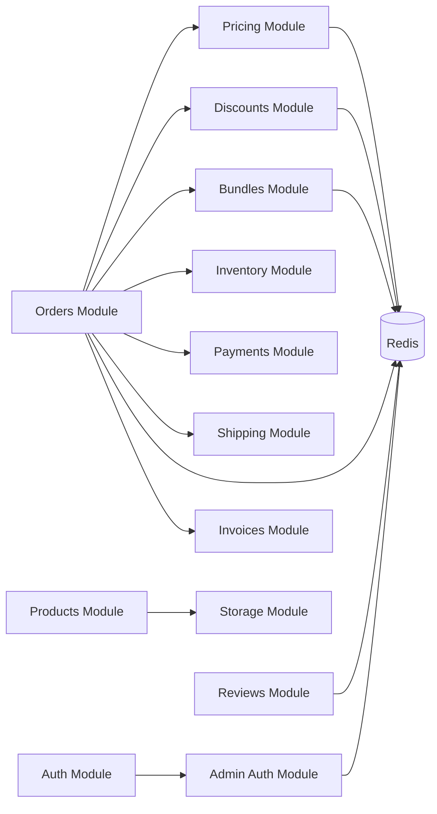

# Cross-Module Dependencies

## Dependency Graph



## Critical Dependencies

### Orders Module Dependencies

The Orders module has the most dependencies as it orchestrates the checkout and order creation flow:

1. **Pricing Module**: Calculates base prices for order items
2. **Discounts Module**: Applies eligible discounts
3. **Bundles Module**: Calculates bundle pricing
4. **Inventory Module**: Reserves inventory for order
5. **Payments Module**: Creates payment intent
6. **Shipping Module**: Calculates shipping costs
7. **Invoices Module**: Generates invoice after order creation

### Pricing Module Dependencies

- **Redis Store Module**: Caches pricing snapshots and price lists
- **Database**: Stores price lists and customer groups

### Discounts Module Dependencies

- **Redis Store Module**: Caches discount rules and eligibility data
- **Database**: Stores discount definitions and rulesets

### Bundles Module Dependencies

- **Redis Store Module**: Caches bundle definitions and eligibility
- **Database**: Stores bundle definitions

## Circular Dependencies

Currently, there are **no circular dependencies** between modules. All dependencies flow in one direction:

```
AppModule
  └── Core Modules (Auth, Products, etc.)
  └── Business Logic Modules (Pricing, Discounts, Bundles)
  └── Orchestration Modules (Orders)
  └── Infrastructure Modules (Redis, Storage)
```

## Shared Services

### Redis Store Service

Used by multiple modules for caching:
- Pricing snapshots
- Discount rules
- Bundle definitions
- Cart data
- Checkout sessions
- Inventory reservations
- Review aggregations

### Context Service

Used by all modules for:
- Request-scoped context (IP, user agent, request ID)
- Activity logging
- Trace correlation

### Logger Service

Used by all modules for:
- Structured logging
- Request correlation
- Error tracking

## Dependency Injection Pattern

All modules use NestJS dependency injection:

```typescript
// Example: OrdersService depends on PricingService
@Injectable()
export class OrdersService {
  constructor(
    private readonly pricingService: PricingService,
    private readonly discountsService: DiscountsService,
    private readonly bundlesService: BundleDefinitionService,
  ) {}
}
```

## Module Exports

Modules export services that other modules depend on:

```typescript
// PricingModule exports
@Module({
  exports: [
    PricingService,
    PricingEngine,
    PricingSnapshotService,
  ],
})
export class PricingModule {}
```

## Best Practices

1. **Explicit Dependencies**: All dependencies declared in module imports
2. **Service Exports**: Only export services that other modules need
3. **No Circular Dependencies**: Maintain one-way dependency flow
4. **Shared Infrastructure**: Use common modules (Redis, Storage) for shared resources
5. **Lazy Loading**: Consider lazy loading for optional dependencies

