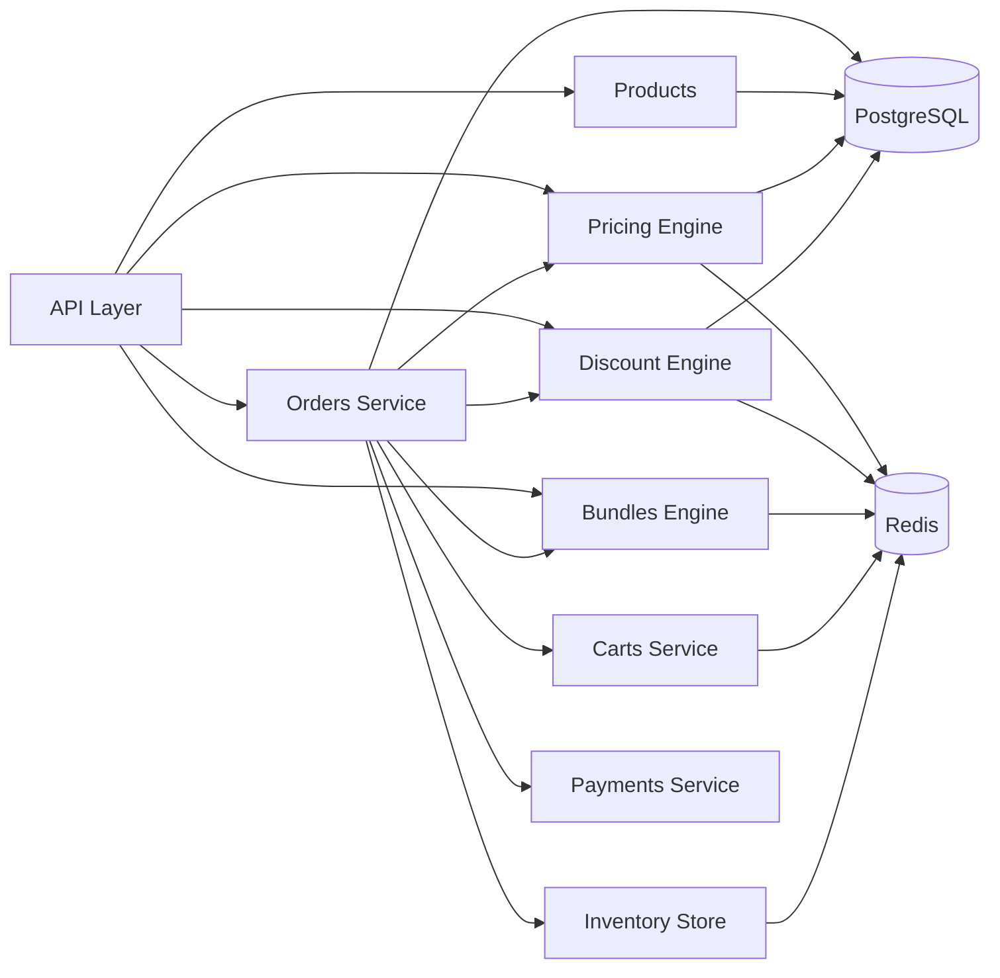

# System Architecture Overview

## Module-Level Breakdown

VCEcom backend is organized into focused modules, each handling a specific domain:

### Core Modules

- **Auth Module**: Customer authentication and session management
- **Admin Auth Module**: Admin authentication with 2FA, session management, and activity logging
- **Products Module**: Product catalog, variants, images, and collections
- **Categories Module**: Hierarchical category management
- **Customers Module**: Customer profiles and addresses
- **Carts Module**: Shopping cart management with Redis persistence

### Pricing & Discounts

- **Pricing Module**: Price lists, customer groups, pricing engine, snapshots
- **Discounts Module**: Discount definitions, deterministic engine, snapshots, drift detection

### Bundles

- **Bundles Module**: Bundle definitions, choice sets, option sets, bundle pricing

### Commerce

- **Orders Module**: Order creation, fulfillment, status management, reconciliation
- **Payments Module**: Payment intent creation, Razorpay integration, webhook handling
- **Shipping Module**: Shiprocket and NimbusPost integration
- **Invoices Module**: GST-compliant invoice generation

### Reviews

- **Reviews Module**: Verified purchase reviews, moderation pipeline, aggregation, caching

### Infrastructure

- **Redis Store Module**: Centralized Redis client and key pattern management
- **Storage Module**: S3-compatible object storage (MinIO/Supabase)
- **Inventory Module**: Inventory tracking and reservations

## Component Interactions

## Cross-Module Dependencies

### Order Creation Flow

1. **Cart Service** retrieves cart items
2. **Pricing Engine** calculates base prices
3. **Discount Engine** applies eligible discounts
4. **Bundles Engine** calculates bundle pricing
5. **Inventory Store** reserves inventory
6. **Payments Service** creates payment intent
7. **Orders Service** creates order record

### Pricing Resolution Flow

1. **Product Variant** base price
2. **Price List** lookup (customer group)
3. **Pricing Engine** applies rules
4. **Discount Engine** applies discounts
5. **Bundles Engine** applies bundle pricing
6. Final effective price returned

## Data Flow Patterns

### Read-Heavy Operations (Cached)

- Product listings
- Pricing calculations
- Discount eligibility checks
- Review aggregations

### Write-Heavy Operations (Database-First)

- Order creation
- Payment processing
- Inventory updates
- Review submissions

### Hybrid Operations

- Cart management (Redis + DB sync)
- Checkout sessions (Redis state + DB persistence)
- Inventory reservations (Redis + DB commit)

## Module Communication Patterns

### Synchronous (Direct Service Injection)

- Services call other services directly via NestJS DI
- Used for: Order → Pricing, Order → Discounts, Order → Bundles

### Asynchronous (Event-Driven)

- Future: Event emitters for order status changes
- Future: Webhook processing for payments

### Cache-First (Redis)

- Pricing snapshots
- Discount snapshots
- Review aggregations
- Cart data

## Scalability Considerations

- **Horizontal Scaling**: Stateless API layer, shared Redis and PostgreSQL
- **Caching Strategy**: Multi-layer caching reduces database load
- **Database Optimization**: Indexed queries, connection pooling
- **Redis Optimization**: Key patterns, TTL management, Lua scripts for atomic operations

