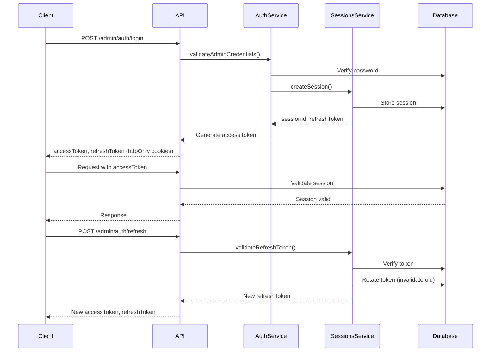
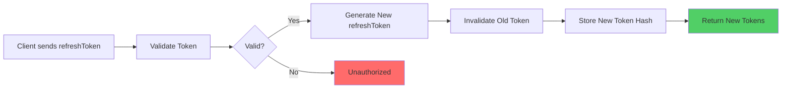
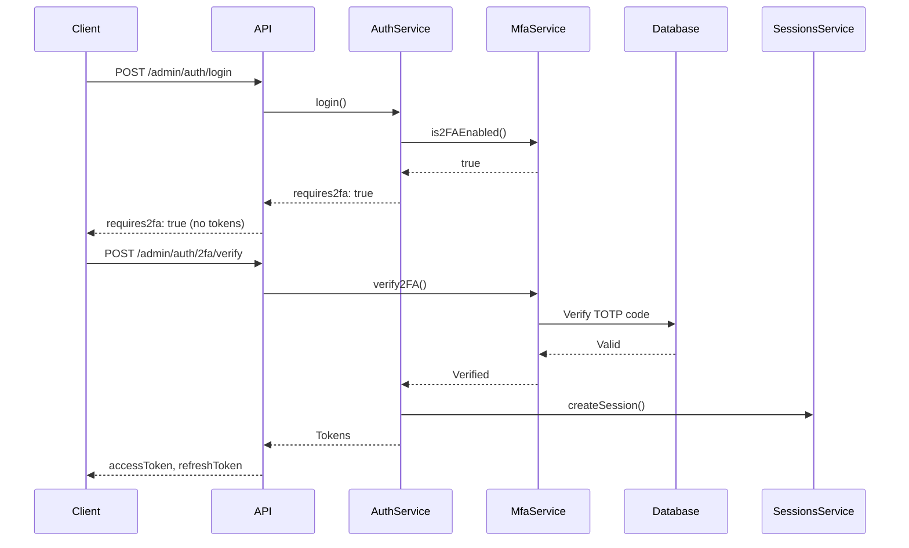

# Admin Authentication

## Overview

Admin authentication in VCEcom uses a secure, session-based system with refresh token rotation, optional 2FA, and comprehensive activity logging.

## Features

- **Session-Based Authentication**: Stateful sessions stored in database
- **Refresh Token Rotation**: New refresh token issued on each refresh, old token invalidated
- **Multi-Device Support**: Admins can have multiple active sessions
- **2FA Support**: Optional TOTP-based two-factor authentication
- **Activity Logging**: All admin actions logged for audit trail
- **Rate Limiting**: Redis-based brute force protection
- **Argon2id Password Hashing**: Modern, secure password hashing

## Session Lifecycle



## JWT + Refresh Token Rotation

### Access Token

- **Lifetime**: 15 minutes (configurable via `ADMIN_ACCESS_TOKEN_EXPIRES_IN`)
- **Storage**: httpOnly cookie (`admin_access_token`)
- **Contains**: `sub`, `email`, `role`, `sessionId`, `type: "admin"`

### Refresh Token

- **Lifetime**: 90 days (configurable via `ADMIN_REFRESH_TOKEN_EXPIRY_DAYS`)
- **Storage**: httpOnly cookie (`admin_refresh_token`)
- **Rotation**: New token issued on each refresh, old token immediately invalidated
- **Security**: Stored as Argon2 hash in database

### Token Rotation Flow



## MFA Flow

When 2FA is enabled, login requires an additional verification step:



## Activity Logging

All admin actions are automatically logged to the `admin_activity_logs` table:

- **Automatic Logging**: Using `@LogActivity` decorator and `ActivityLoggingInterceptor`
- **Logged Fields**: Admin ID, action, entity ID, metadata, IP address, user agent, timestamp
- **Sensitive Data Filtering**: Passwords, tokens, and secrets are automatically excluded

### Example Log Entry

```json
{
  "adminId": "uuid",
  "action": "product.create",
  "entityId": "product-123",
  "metadata": {
    "title": "New Product",
    "price": 999.99
  },
  "ipAddress": "192.168.1.1",
  "userAgent": "Mozilla/5.0...",
  "createdAt": "2025-12-18T00:00:00Z"
}
```

## Security Model

### Password Security

- **Hashing**: Argon2id (recommended for admins)
- **Migration**: Automatic migration from bcrypt to Argon2id on login
- **Verification**: Supports both algorithms during transition

### Session Security

- **Session Validation**: Every request validates session exists and is not expired
- **Session Revocation**: Admins can revoke individual or all sessions
- **Token Reuse Detection**: Refresh token rotation detects and invalidates reused tokens

### Rate Limiting

- **Redis-Based**: IP-based rate limiting for login attempts
- **Default Limit**: 10 attempts per 10 minutes
- **Configurable**: Via `ADMIN_LOGIN_RATE_LIMIT` and `ADMIN_LOGIN_RATE_WINDOW`

## API Endpoints

### Authentication

- `POST /admin/auth/login` - Admin login
- `POST /admin/auth/2fa/verify` - Verify 2FA and complete login
- `POST /admin/auth/refresh` - Refresh access token
- `DELETE /admin/auth/logout` - Logout current device
- `DELETE /admin/auth/logout/all` - Logout all devices

### Session Management

- `GET /admin/auth/sessions` - List active sessions
- `DELETE /admin/auth/sessions/:sessionId` - Revoke a session
- `GET /admin/auth/me` - Get current admin info

### 2FA Management

- `GET /admin/auth/2fa/status` - Check 2FA status
- `POST /admin/auth/2fa/generate-secret` - Generate TOTP secret
- `POST /admin/auth/2fa/enable` - Enable 2FA
- `POST /admin/auth/2fa/disable` - Disable 2FA
- `POST /admin/auth/2fa/verify` - Verify 2FA code

## Database Schema

### admin_sessions

Stores active admin sessions:

```sql
CREATE TABLE admin_sessions (
  id UUID PRIMARY KEY,
  admin_id UUID NOT NULL REFERENCES users(id),
  refresh_token_hash TEXT NOT NULL UNIQUE,
  device_id TEXT NOT NULL,
  user_agent TEXT,
  ip_address TEXT,
  created_at TIMESTAMP NOT NULL,
  expires_at TIMESTAMP NOT NULL,
  last_used_at TIMESTAMP NOT NULL
);
```

### admin_activity_logs

Append-only log of admin actions:

```sql
CREATE TABLE admin_activity_logs (
  id UUID PRIMARY KEY,
  admin_id UUID REFERENCES users(id),
  action TEXT NOT NULL,
  entity_id TEXT,
  metadata JSONB,
  ip_address TEXT,
  user_agent TEXT,
  created_at TIMESTAMP NOT NULL
);
```

### admin_2fa

Stores 2FA configuration:

```sql
CREATE TABLE admin_2fa (
  admin_id UUID PRIMARY KEY REFERENCES users(id),
  secret TEXT NOT NULL,
  backup_codes TEXT[],
  enabled BOOLEAN NOT NULL DEFAULT false
);
```

## Configuration

### Environment Variables

```env
# Token Expiration
ADMIN_ACCESS_TOKEN_EXPIRES_IN=15m
ADMIN_REFRESH_TOKEN_EXPIRY_DAYS=90
ADMIN_SESSION_EXPIRY_DAYS=30

# Rate Limiting
ADMIN_LOGIN_RATE_LIMIT=10
ADMIN_LOGIN_RATE_WINDOW=600

# App Name (for 2FA QR codes)
APP_NAME=VCEcom Admin
```

## Developer Notes

### Adding Activity Logging

Use the `@LogActivity` decorator on controller methods:

```typescript
@Post()
@LogActivity("product.create")
async create(@Body() dto: CreateProductDto) {
  return this.productsService.create(dto);
}
```

### Custom Entity ID

Specify a custom parameter name for entity ID:

```typescript
@Put(":id")
@LogActivity("product.update", "id")
async update(@Param("id") id: string, @Body() dto: UpdateProductDto) {
  return this.productsService.update(id, dto);
}
```

## Edge Cases

- **Expired Sessions**: Automatically cleaned up on validation
- **Token Reuse**: Detected during refresh, session invalidated
- **2FA Backup Codes**: Single-use, removed after verification
- **Concurrent Logins**: Multiple sessions allowed per admin
- **Session Limit**: No hard limit, but admins can revoke old sessions

## Integration Points

- **JwtStrategy**: Validates admin sessions on every request
- **RolesGuard**: Enforces role-based access control
- **ActivityLoggingInterceptor**: Automatically logs admin actions
- **RedisStoreService**: Used for rate limiting

