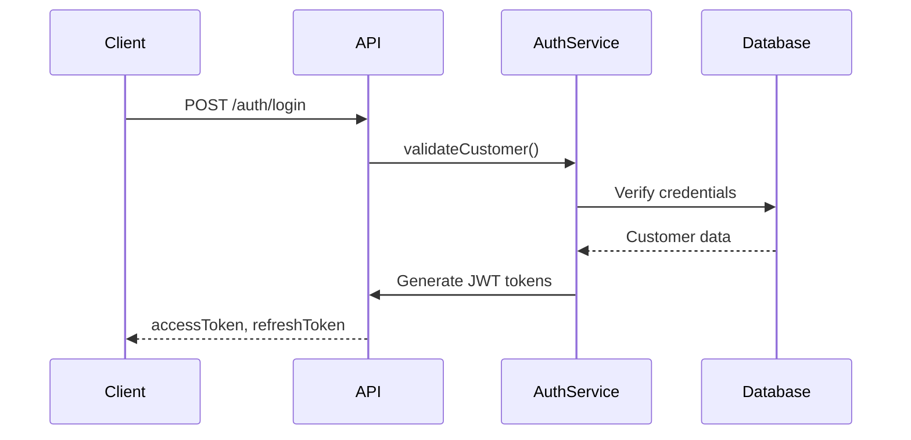

# Storefront Authentication

## Overview

Storefront authentication handles customer login, registration, and session management for the ecommerce storefront. The system also supports **guest checkout** which allows customers to complete purchases without creating an account.

## Features

- **JWT-Based Authentication**: Stateless JWT tokens for customer sessions
- **Password Security**: Bcrypt password hashing
- **Session Management**: Refresh token support
- **Customer Profiles**: Customer data and address management
- **Guest Checkout**: Zero-friction checkout without account creation
- **Account Claiming**: Convert guest customers to accounts post-purchase

## Authentication Flow

## API Endpoints

- `POST /auth/register` - Customer registration
- `POST /auth/login` - Customer login
- `POST /auth/refresh` - Refresh access token
- `POST /auth/logout` - Logout
- `GET /auth/me` - Get current customer info
- `POST /customers/claim` - Claim guest account (convert guest to account)

## Guest Checkout

Guest checkout allows customers to complete purchases without authentication:

- **No Registration Required**: Customers can checkout with just email, name, phone, and address
- **Automatic Customer Creation**: Guest customers are stored with `isGuest=true`
- **Account Upgrade**: Guests can set a password during checkout to create an account
- **Post-Purchase Claiming**: Guests can claim their account later using the claim endpoint

See [Guest Checkout Documentation](/docs/checkout/guest-checkout) for complete details.

## Password Security

- **Hashing**: Bcrypt with salt rounds
- **Verification**: Secure password comparison
- **Reset**: Password reset flow (future)

## Session Strategy

- **Access Token**: Short-lived (15 minutes)
- **Refresh Token**: Long-lived (30 days)
- **Storage**: httpOnly cookies or localStorage (client choice)

## Integration Points

- **Customers Module**: Customer profile management
- **Orders Module**: Order history linked to customer
- **Carts Module**: Cart persistence per customer

