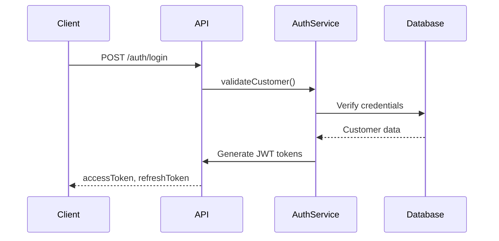

# Storefront Authentication

## Overview

Storefront authentication handles customer login, registration, and session management for the ecommerce storefront.

## Features

- **JWT-Based Authentication**: Stateless JWT tokens for customer sessions
- **Password Security**: Bcrypt password hashing
- **Session Management**: Refresh token support
- **Customer Profiles**: Customer data and address management

## Authentication Flow

## API Endpoints

- `POST /auth/register` - Customer registration
- `POST /auth/login` - Customer login
- `POST /auth/refresh` - Refresh access token
- `POST /auth/logout` - Logout
- `GET /auth/me` - Get current customer info

## Password Security

- **Hashing**: Bcrypt with salt rounds
- **Verification**: Secure password comparison
- **Reset**: Password reset flow (future)

## Session Strategy

- **Access Token**: Short-lived (15 minutes)
- **Refresh Token**: Long-lived (30 days)
- **Storage**: httpOnly cookies or localStorage (client choice)

## Integration Points

- **Customers Module**: Customer profile management
- **Orders Module**: Order history linked to customer
- **Carts Module**: Cart persistence per customer

