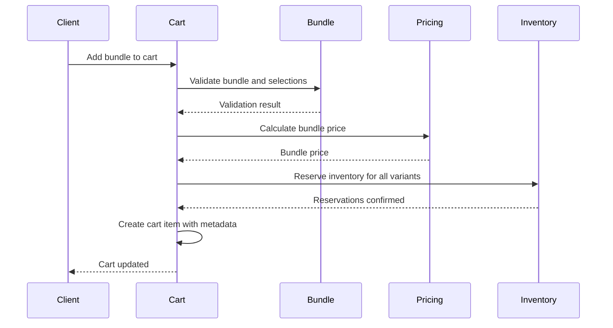

# Bundle Cart Integration

Bundles integrate seamlessly with the cart system, allowing customers to add custom bundle configurations to their shopping cart. The system handles bundle selections, pricing, inventory, and cart operations.

## Cart Integration Overview

### Bundle Cart Items

Bundles are stored in the cart as special cart items with metadata:

```typescript
interface BundleCartItemMetadata {
  type: "bundle";
  bundleId: string;
  selections: UserBundleSelection;
  bundleTitle: string;
}
```

### Cart Item Structure

```typescript
interface CartItem {
  id: string;
  cartId: string;
  productVariantId: string;  // First variant ID (required by schema)
  quantity: number;           // Bundle quantity
  price: number;              // Unit bundle price
  metadata: BundleCartItemMetadata;
}
```

## Adding Bundles to Cart

### Add Bundle Request

```http
POST /storefront/cart/items
Content-Type: application/json

{
  "type": "bundle",
  "bundleId": "bundle-123",
  "selections": {
    "set-1": ["variant-a"],
    "set-2": ["variant-b", "variant-c"]
  },
  "quantity": 2
}
```

### Add Bundle Flow



### Selection Validation

Before adding to cart, selections are validated:

```typescript
// Validate all sets have selections
for (const set of bundle.sets) {
  const selected = selections[set.id] || [];
  if (selected.length < set.minQuantity) {
    throw new Error(`Select at least ${set.minQuantity} items`);
  }
  if (selected.length > set.maxQuantity) {
    throw new Error(`Select at most ${set.maxQuantity} items`);
  }
}
```

## Inventory Reservation

### Variant Inventory

Bundles reserve inventory for all selected variants:

```typescript
// Flatten bundle selections into variant quantities
const variantQuantities = flattenBundleSelections(
  selections,
  bundleQuantity,
);

// Reserve inventory for each variant
for (const vq of variantQuantities) {
  await inventoryStore.reserveInventory(
    cartId,
    vq.variantId,
    vq.quantity,
  );
}
```

### Reservation Keys

Each variant gets its own reservation:
- **Key Pattern**: `inventory:reservation:{cartId}:{variantId}`
- **TTL**: 30 minutes (configurable)
- **Quantity**: Reserved quantity per variant

### Bundle Inventory Example

For a bundle with:
- Set 1: Variant A (quantity: 1)
- Set 2: Variant B (quantity: 2)
- Bundle Quantity: 2

**Reservations**:
- Variant A: 2 units reserved (1 × 2)
- Variant B: 4 units reserved (2 × 2)

## Bundle Pricing in Cart

### Price Calculation

Bundle prices are calculated when added to cart:

```typescript
const unitBundlePrice = await bundlePricingService.calculateBundlePrice(
  bundleId,
  selections,
  1,  // unit price
  customerId,
);

// Store in cart item
cartItem.price = unitBundlePrice;
cartItem.quantity = bundleQuantity;
```

### Price Updates

- Prices recalculate on cart refresh
- Customer group changes update prices
- Sale price activations affect bundle prices

## Updating Bundle Quantities

### Update Request

```http
PATCH /storefront/cart/items/{itemId}
Content-Type: application/json

{
  "quantity": 3
}
```

### Update Flow

```typescript
async updateBundleInCart(
  cartId: string,
  itemId: string,
  metadata: BundleCartItemMetadata,
  oldQuantity: number,
  newQuantity: number,
) {
  // Calculate quantity difference
  const quantityDiff = newQuantity - oldQuantity;
  
  // Update inventory reservations
  const variantQuantities = flattenBundleSelections(
    metadata.selections,
    Math.abs(quantityDiff),
  );
  
  if (quantityDiff > 0) {
    // Increase reservations
    for (const vq of variantQuantities) {
      await inventoryStore.reserveInventory(
        cartId,
        vq.variantId,
        vq.quantity,
      );
    }
  } else {
    // Decrease reservations
    for (const vq of variantQuantities) {
      await inventoryStore.releaseInventory(
        cartId,
        vq.variantId,
        vq.quantity,
      );
    }
  }
  
  // Update cart item quantity
  await updateCartItemQuantity(itemId, newQuantity);
}
```

## Removing Bundles from Cart

### Remove Flow

```typescript
async removeBundleFromCart(cartId: string, itemId: string) {
  // Get bundle metadata
  const item = await getCartItem(itemId);
  const metadata = item.metadata as BundleCartItemMetadata;
  
  // Release all variant reservations
  const variantQuantities = flattenBundleSelections(
    metadata.selections,
    item.quantity,
  );
  
  for (const vq of variantQuantities) {
    await inventoryStore.releaseInventory(
      cartId,
      vq.variantId,
      vq.quantity,
    );
  }
  
  // Remove cart item
  await deleteCartItem(itemId);
}
```

## Cart Totals Calculation

### Bundle Contribution

Bundles contribute to cart totals:

```typescript
// Calculate cart subtotal
const subtotal = cartItems.reduce((sum, item) => {
  return sum + (item.price * item.quantity);
}, 0);

// Bundle items included in subtotal
// Discounts applied after subtotal calculation
```

### GST Calculation

GST is calculated per variant in the bundle:

```typescript
// For each variant in bundle
const gstAmount = (variantPrice * gstRate) * quantity;

// Total GST = sum of all variant GST amounts
```

## Bundle Display in Cart

### Cart Item Display

```typescript
interface CartItemDisplay {
  id: string;
  type: "bundle";
  title: string;  // Bundle title
  quantity: number;
  unitPrice: number;
  totalPrice: number;
  selections: {
    setTitle: string;
    selectedVariants: VariantDisplay[];
  }[];
}
```

### Variant Breakdown

Show customers what's included:

```typescript
// Display bundle contents
bundle.selections.forEach((setId, variantIds) => {
  const set = bundle.sets.find(s => s.id === setId);
  displaySet(set.title, variantIds);
});
```

## Checkout Integration

### Bundle Processing in Checkout

During checkout, bundles are processed like regular items:

```typescript
// Separate bundle and variant items
const bundleCartItems = cartItems.filter(
  item => item.metadata?.type === "bundle"
);
const variantCartItems = cartItems.filter(
  item => !item.metadata || item.metadata.type !== "bundle"
);

// Process bundles separately
for (const bundleItem of bundleCartItems) {
  const metadata = bundleItem.metadata as BundleCartItemMetadata;
  const variantQuantities = flattenBundleSelections(
    metadata.selections,
    bundleItem.quantity,
  );
  
  // Create order items for each variant
  for (const vq of variantQuantities) {
    await createOrderItem(orderId, vq.variantId, vq.quantity);
  }
}
```

### Order Item Creation

Each variant in a bundle becomes a separate order item:

```typescript
// Bundle with 2 variants, quantity 2
// Creates 2 order items:
// - Order Item 1: Variant A, quantity 2
// - Order Item 2: Variant B, quantity 4
```

## Cart Validation

### Bundle Validation Rules

1. **Active Bundle**: Bundle must be active
2. **Valid Selections**: All selections must be valid
3. **Inventory Available**: All variants must have inventory
4. **Quantity Limits**: Respect min/max quantities per set

### Validation Errors

```typescript
// Common validation errors
- "Bundle is not active"
- "Invalid selection for set X"
- "Insufficient inventory for variant Y"
- "Selection quantity exceeds maximum"
```

## API Endpoints

### Add Bundle to Cart

```http
POST /storefront/cart/items
{
  "type": "bundle",
  "bundleId": "bundle-123",
  "selections": { ... },
  "quantity": 1
}
```

### Update Bundle Quantity

```http
PATCH /storefront/cart/items/{itemId}
{
  "quantity": 2
}
```

### Remove Bundle

```http
DELETE /storefront/cart/items/{itemId}
```

### Get Cart

```http
GET /storefront/cart
```

**Response includes bundles**:
```json
{
  "items": [
    {
      "id": "item-123",
      "type": "bundle",
      "bundleId": "bundle-123",
      "bundleTitle": "Custom Pizza Bundle",
      "quantity": 2,
      "price": 1000,
      "selections": { ... }
    }
  ]
}
```

## Error Handling

### Inventory Unavailable

```typescript
if (availableInventory < requiredQuantity) {
  throw new BadRequestException(
    `Insufficient inventory. Available: ${available}`
  );
}
```

### Invalid Selections

```typescript
if (!isValidSelection(bundle, selections)) {
  throw new BadRequestException("Invalid bundle selections");
}
```

### Bundle Not Found

```typescript
if (!bundle || !bundle.isActive) {
  throw new NotFoundException("Bundle not found or inactive");
}
```

## Performance Considerations

### Batch Operations

- Inventory reservations are batched
- Price calculations are optimized
- Cart updates are atomic

### Caching

- Bundle definitions cached
- Variant prices cached
- Cart data cached per session

## Best Practices

1. **Validate Early**: Validate selections before adding to cart
2. **Clear Errors**: Provide clear error messages for validation failures
3. **Show Breakdown**: Display bundle contents in cart UI
4. **Handle Updates**: Support quantity updates gracefully
5. **Inventory Checks**: Always check inventory before operations

## Edge Cases

### Bundle Deactivated After Add

- Bundles remain in cart if deactivated
- Checkout validates bundle is still active
- Admin can manually remove inactive bundles

### Variant Price Changes

- Cart prices may change on refresh
- Checkout recalculates all prices
- Order creation freezes prices

### Inventory Depletion

- Partial inventory available handled gracefully
- Clear error messages for unavailable items
- Suggest alternatives when possible

