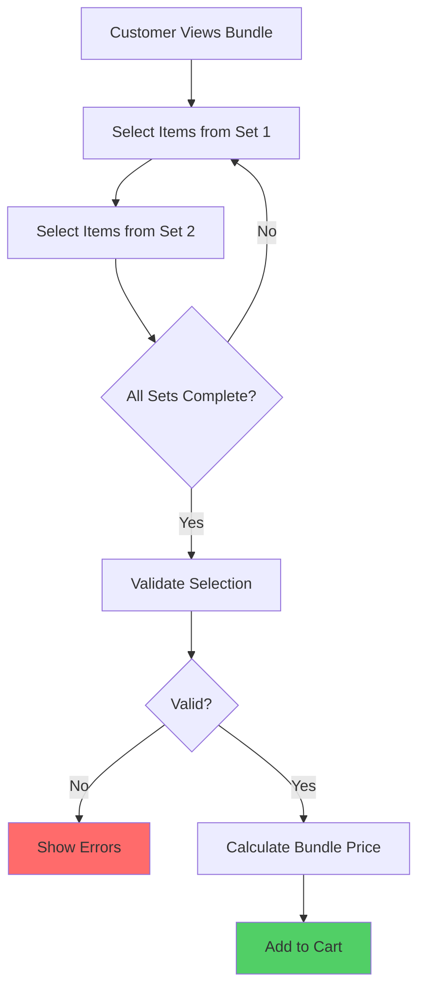

# Bundles Engine Overview

## Architecture

The bundles engine allows customers to create custom product bundles by selecting items from predefined choice sets. Each bundle can have multiple sets, and customers choose items from each set.

## Key Concepts

### Bundle

A bundle is a collection of choice sets. Customers select items from each set to create their custom bundle.

### Choice Set

A choice set defines a group of products that customers can choose from. Each set has:
- **Title**: Name of the set (e.g., "Choose your T-shirt")
- **Min Quantity**: Minimum items required (e.g., 1)
- **Max Quantity**: Maximum items allowed (e.g., 1)
- **Items**: Available product variants

### Option Set

An option set is a choice set with only one item (minQuantity = maxQuantity = 1). Used for required items in bundles.

## Bundle Structure

```typescript
interface Bundle {
  id: string;
  title: string;
  description?: string;
  isActive: boolean;
  allowMixAndMatch: boolean; // Allow mixing variants from same product
  sets: BundleSet[];
}

interface BundleSet {
  id: string;
  title: string;
  description?: string;
  minQuantity: number; // Required picks (0-15)
  maxQuantity: number; // Allowed picks (1-15)
  sortOrder: number;
  items: BundleSetItem[];
}

interface BundleSetItem {
  id: string;
  variantId: string;
}
```

## Bundle Flow



## Example Bundle

### T-Shirt Bundle

```json
{
  "title": "Custom T-Shirt Bundle",
  "description": "Create your perfect T-shirt bundle",
  "sets": [
    {
      "title": "Choose your T-shirt",
      "minQuantity": 1,
      "maxQuantity": 1,
      "items": [
        { "variantId": "tshirt-red-m" },
        { "variantId": "tshirt-blue-m" },
        { "variantId": "tshirt-green-m" }
      ]
    },
    {
      "title": "Choose your size",
      "minQuantity": 1,
      "maxQuantity": 1,
      "items": [
        { "variantId": "size-s" },
        { "variantId": "size-m" },
        { "variantId": "size-l" }
      ]
    }
  ]
}
```

## Selection Validation

Customer selections are validated against bundle rules:

1. **All Sets Present**: Customer must select from all sets
2. **Quantity Constraints**: Selections must meet min/max requirements
3. **Item Validity**: Selected items must exist in their respective sets
4. **Mix and Match**: If `allowMixAndMatch: false`, can't mix variants from same product

## Bundle Pricing

Bundle pricing can be:

1. **Sum of Selected Items**: Total of individual variant prices
2. **Fixed Bundle Price**: Set price regardless of selections
3. **Percentage Discount**: Discount applied to sum of items

## API Endpoints

- `GET /bundles` - List active bundles
- `GET /bundles/:id` - Get bundle details
- `POST /bundles/:id/validate` - Validate customer selection
- `POST /bundles/:id/calculate-price` - Calculate bundle price
- `POST /admin/bundles` - Create bundle (admin)
- `GET /admin/bundles` - List all bundles (admin)

## Caching

Bundles are cached in Redis:

- **Cache Key**: `bundles:bundle:{id}`
- **TTL**: 1 hour
- **Invalidation**: On bundle create/update/delete

## Best Practices

1. **Clear Set Titles**: Use descriptive titles for each set
2. **Reasonable Limits**: Keep min/max quantities reasonable (1-5)
3. **Test Validation**: Test selection validation thoroughly
4. **Monitor Usage**: Track which bundles are most popular
5. **Document Rules**: Document bundle rules clearly

## Edge Cases

- **No Sets**: Bundle must have at least one set
- **Empty Sets**: Sets must have at least one item
- **Invalid Selection**: Returns validation errors
- **Inactive Bundle**: Not shown to customers
- **Max Sets Exceeded**: Maximum 15 sets per bundle

