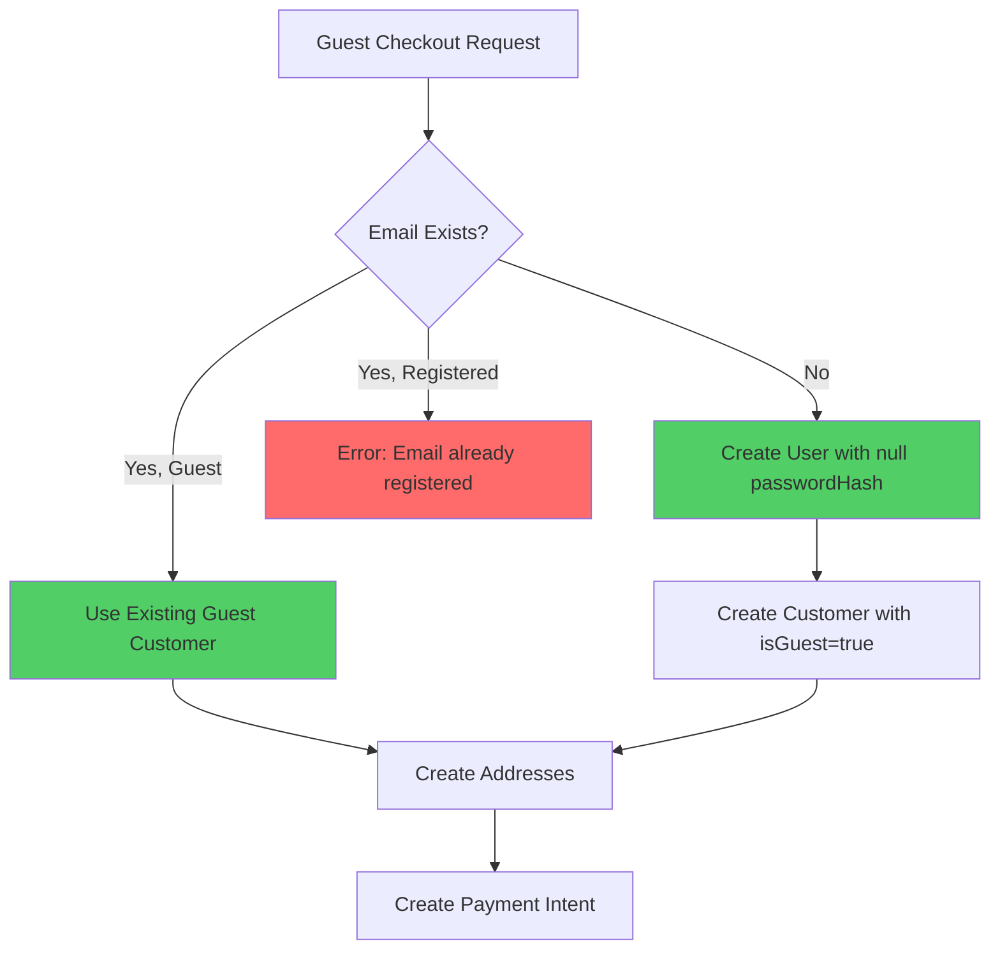

# Guest Checkout

## Overview

Guest checkout allows customers to complete purchases without creating an account. This reduces friction and improves conversion rates by eliminating the registration barrier.

## Key Features

- **Zero Friction**: No account creation required
- **Automatic Customer Creation**: Guests are stored as customer records with `isGuest=true`
- **Account Upgrade**: Guests can optionally set a password during checkout to create an account
- **Seamless Experience**: Same checkout flow for both authenticated and guest customers

## Architecture

### Guest Customer Model

Guests are stored as regular customer records with special flags:

- `isGuest: true` - Identifies guest customers
- `emailVerified: false` - Email not verified (unless password set)
- `passwordHash: null` - No password set (user record has nullable password_hash)

### Customer Creation Flow



## Checkout Flow

### Guest Checkout Request

```http
POST /orders
X-Session-Id: {session-id}
Content-Type: application/json

{
  "email": "guest@example.com",
  "name": "Guest User",
  "phone": "+919876543210",
  "address": {
    "type": "shipping",
    "street": "123 Main St",
    "city": "Mumbai",
    "state": "Maharashtra",
    "pincode": "400001",
    "district": "Mumbai",
    "country": "India"
  },
  "password": "SecurePassword123!",
  "shippingCost": 50.0
}
```

### Required Fields

For guest checkout, the following fields are required:

- `email` - Customer email address
- `name` - Customer name
- `phone` - Customer phone number
- `address` - Shipping address object
- `X-Session-Id` header - Session ID for cart linking

### Optional Fields

- `password` - If provided, creates an account instead of guest checkout
- `shippingCost` - Shipping cost override

## Account Creation During Checkout

If a password is provided during guest checkout:

1. User record is created with `passwordHash` set
2. Customer record is created with `isGuest=false` and `emailVerified=true`
3. Customer can immediately login with email and password

## Cart Management

### Guest Carts

- Guest carts are linked via `sessionId` (not `customerId`)
- Session ID is provided via `X-Session-Id` header
- Cart persists for 30 days
- Cart can be merged with customer cart on login

### Cart Linking

When a guest completes checkout:

1. Customer record is created (or reused if email exists as guest)
2. Cart remains linked to `sessionId` during checkout
3. After order creation, cart can optionally be linked to `customerId`

## Order Creation

Orders created from guest checkout:

- Are linked to `customerId` (not `userId`)
- Use `customerId` from checkout metadata
- Support all standard order features (refunds, reviews, etc.)
- Appear in admin panel normally

## Claim Account Flow

After guest checkout, customers can claim their account:

```http
POST /customers/claim
Content-Type: application/json

{
  "email": "guest@example.com",
  "token": "verification-token",
  "newPassword": "SecurePassword123!"
}
```

This converts the guest customer to a regular account:

- Sets `isGuest=false`
- Sets `emailVerified=true`
- Updates `passwordHash` in user record

## Security Considerations

### Guest Access Restrictions

Guests cannot access:

- `/customers/me` - Requires authentication
- `/orders/me` - Requires authentication
- `/auth/refresh` - Requires authentication

### Email Uniqueness

- If email exists as registered customer → Error
- If email exists as guest → Reuse existing guest customer
- Email uniqueness is enforced at customer level

### Phone Uniqueness

- Phone numbers must be unique across all customers
- Required for guest checkout
- Used for order tracking and communication

## Checkout Metadata

Checkout metadata stores:

```typescript
{
  customerId: string;      // Required - customer ID
  userId: string | null;   // Optional - null for guests
  shippingAddressId: string;
  billingAddressId: string;
  shippingCost: number;
  discountSnapshot: DiscountSnapshot | null;
  pricingSnapshot: PricingSnapshot | null;
  createdAt: string;
}
```

**Key Change**: `customerId` is now the primary identifier (not `userId`).

## Integration Points

### Pricing Engine

- Works identically for guests and authenticated customers
- Uses `customerId` for customer group resolution
- Guest customers have no customer group (null)

### Discount Engine

- Applies discounts based on cart contents
- No customer-specific discounts for guests
- Discount snapshots work identically

### Inventory Management

- Inventory reservation works identically
- No difference between guest and authenticated checkout
- Same reservation and commit flow

### Payment Processing

- Payment intents created identically
- Webhook processing uses `customerId` from metadata
- No changes to payment flow

## Error Handling

### Common Errors

**Missing Required Fields**
```json
{
  "statusCode": 400,
  "message": "Email, name, phone, and address are required for guest checkout"
}
```

**Missing Session ID**
```json
{
  "statusCode": 400,
  "message": "Session ID is required for guest checkout"
}
```

**Email Already Registered**
```json
{
  "statusCode": 400,
  "message": "Email already registered. Please login to continue."
}
```

**Phone Already Exists**
```json
{
  "statusCode": 400,
  "message": "Customer with this phone number already exists"
}
```

## Best Practices

1. **Session Management**: Always provide `X-Session-Id` header for guest checkout
2. **Email Collection**: Collect email early in the checkout process
3. **Account Upsell**: Offer account creation option during checkout
4. **Order Tracking**: Provide order lookup by email + order ID for guests
5. **Post-Purchase**: Send "claim account" email after guest checkout

## Migration Notes

### Backward Compatibility

- Existing authenticated checkout flow remains unchanged
- All existing endpoints continue to work
- No breaking changes to authenticated flow

### Database Changes

- `customers.is_guest` - Boolean, defaults to `true`
- `customers.email_verified` - Boolean, defaults to `false`
- `users.password_hash` - Now nullable for guest users

### API Changes

- `POST /orders` - Now public (supports guest checkout)
- `POST /customers/claim` - New endpoint for account claiming
- Checkout metadata includes `customerId` field

