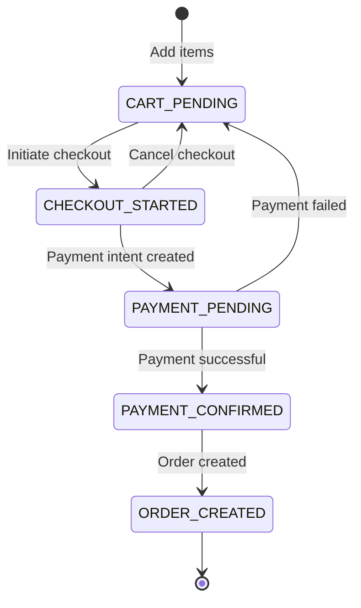
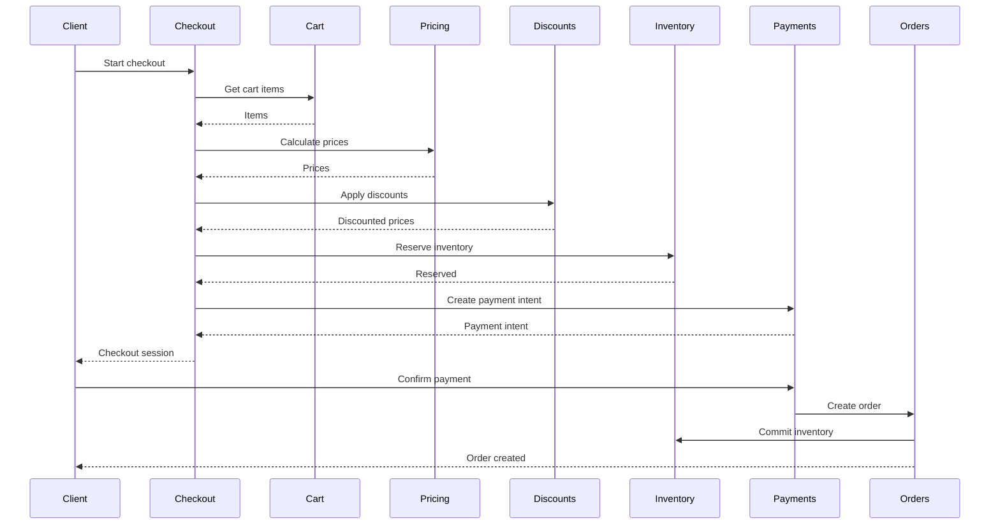
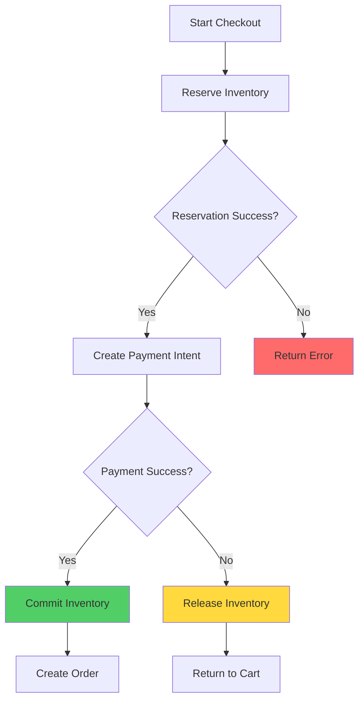

# Checkout System Overview

## State Machine

The checkout process follows a state machine pattern:

## Checkout Flow

## Checkout States

### CART_PENDING
- Cart has items
- No checkout session active
- Items can be modified

### CHECKOUT_STARTED
- Checkout session created
- Cart locked (no modifications)
- Inventory reserved
- Session stored in Redis

### PAYMENT_PENDING
- Payment intent created
- Waiting for payment confirmation
- Inventory still reserved
- Session expires after timeout

### PAYMENT_CONFIRMED
- Payment successful
- Order creation in progress
- Inventory committed

### ORDER_CREATED
- Order created successfully
- Checkout session completed
- Inventory committed

## Inventory Flow

## Payment Intent Creation

Payment intents are created via Razorpay:

1. Calculate total amount (prices + discounts + shipping)
2. Create Razorpay order
3. Store payment intent in checkout session
4. Return payment details to client

## Webhook Reconciliation

Payment webhooks reconcile payments:

1. **Payment Success**: Create order, commit inventory
2. **Payment Failed**: Release inventory, unlock cart
3. **Idempotency**: Prevent duplicate order creation

## Redis Session Storage

Checkout sessions stored in Redis:

- **Key Pattern**: `checkout:session:{sessionId}`
- **TTL**: 30 minutes (configurable)
- **Data**: Cart items, pricing, discounts, payment intent

## Guest Checkout

The system supports guest checkout, allowing customers to complete purchases without creating an account. See [Guest Checkout Documentation](/docs/checkout/guest-checkout) for details.

### Guest vs Authenticated Checkout

- **Authenticated**: Requires JWT token, uses existing customer and addresses
- **Guest**: Public endpoint, creates customer on-the-fly, requires session ID

Both flows use the same order creation pipeline and payment processing.

## API Endpoints

- `POST /orders` - Create payment intent (supports both authenticated and guest checkout)
- `GET /orders` - List orders (authenticated only)
- `GET /orders/:id` - Get order (authenticated only)
- `POST /customers/claim` - Claim guest account (public)

## Error Handling

- **Inventory Unavailable**: Release reservation, return error
- **Payment Failed**: Release inventory, unlock cart
- **Session Expired**: Return error, require new checkout
- **Concurrent Modifications**: Use Redis locks

