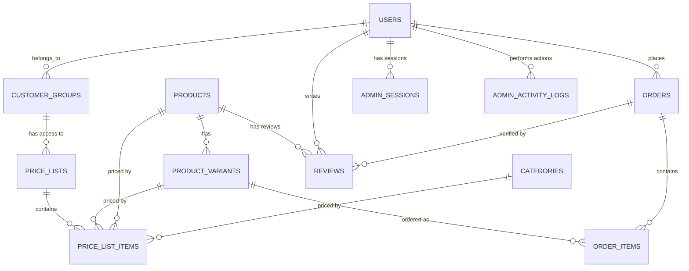

# Entity Relationship Diagram

## Core Entities

## Relationships

### Users → Orders

One user can place many orders.

### Products → Variants

One product can have many variants.

### Orders → Order Items

One order contains many order items.

### Customer Groups → Price Lists

One customer group can have access to many price lists.

### Price Lists → Price List Items

One price list contains many price list items.

### Users → Admin Sessions

One admin user can have many active sessions.

### Users → Admin Activity Logs

One admin user generates many activity log entries.

## Key Relationships

- **Users** are the central entity (customers and admins)
- **Products** and **Variants** form the catalog
- **Orders** link users to products via order items
- **Pricing** is managed through customer groups and price lists
- **Admin** operations are tracked through sessions and activity logs

