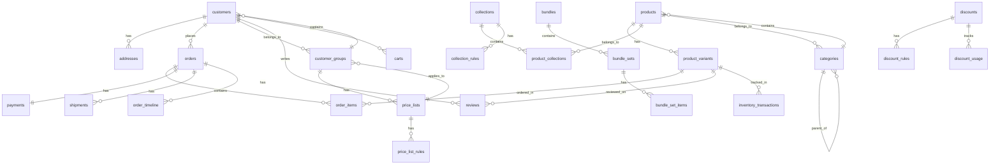

# Database Schema Overview

VCEcom uses PostgreSQL as the primary data store with a normalized relational schema optimized for ecommerce operations. The schema is designed for performance, data integrity, and scalability.

## Schema Architecture

### Core Design Principles

#### Normalization
- **Third Normal Form (3NF)**: Eliminates transitive dependencies
- **Data Integrity**: Foreign key constraints and check constraints
- **Consistency**: Single source of truth for all business data

#### Performance Optimization
- **Strategic Indexing**: Composite indexes for common query patterns
- **Partitioning**: Time-based partitioning for large tables
- **Connection Pooling**: Efficient database connection management

#### Scalability Considerations
- **Read Replicas**: Separate read and write workloads
- **Sharding**: Future horizontal scaling capabilities
- **Archival**: Data lifecycle management

## Entity-Relationship Diagram



## Core Tables

### Customers & Authentication

#### customers
```sql
CREATE TABLE customers (
  id UUID PRIMARY KEY DEFAULT gen_random_uuid(),
  email VARCHAR(255) UNIQUE NOT NULL,
  name VARCHAR(255),
  phone VARCHAR(20),
  password_hash VARCHAR(255),
  email_verified BOOLEAN DEFAULT FALSE,
  phone_verified BOOLEAN DEFAULT FALSE,
  customer_group_id UUID REFERENCES customer_groups(id),
  is_active BOOLEAN DEFAULT TRUE,
  created_at TIMESTAMP WITH TIME ZONE DEFAULT NOW(),
  updated_at TIMESTAMP WITH TIME ZONE DEFAULT NOW()
);

-- Indexes
CREATE INDEX idx_customers_email ON customers(email);
CREATE INDEX idx_customers_group ON customers(customer_group_id);
CREATE INDEX idx_customers_active ON customers(is_active);
CREATE INDEX idx_customers_created ON customers(created_at);
```

#### addresses
```sql
CREATE TABLE addresses (
  id UUID PRIMARY KEY DEFAULT gen_random_uuid(),
  customer_id UUID NOT NULL REFERENCES customers(id) ON DELETE CASCADE,
  type VARCHAR(20) CHECK (type IN ('billing', 'shipping')),
  name VARCHAR(255) NOT NULL,
  company VARCHAR(255),
  address_line_1 VARCHAR(255) NOT NULL,
  address_line_2 VARCHAR(255),
  city VARCHAR(100) NOT NULL,
  state VARCHAR(100) NOT NULL,
  postal_code VARCHAR(20) NOT NULL,
  country VARCHAR(2) DEFAULT 'IN', -- ISO 3166-1 alpha-2
  phone VARCHAR(20),
  is_default BOOLEAN DEFAULT FALSE,
  created_at TIMESTAMP WITH TIME ZONE DEFAULT NOW(),
  updated_at TIMESTAMP WITH TIME ZONE DEFAULT NOW(),

  UNIQUE(customer_id, type, is_default) DEFERRABLE INITIALLY DEFERRED
);

-- Indexes
CREATE INDEX idx_addresses_customer ON addresses(customer_id);
CREATE INDEX idx_addresses_type ON addresses(type);
```

### Product Catalog

#### products
```sql
CREATE TABLE products (
  id UUID PRIMARY KEY DEFAULT gen_random_uuid(),
  title VARCHAR(255) NOT NULL,
  description TEXT,
  price DECIMAL(10,2) NOT NULL CHECK (price >= 0),
  gst_rate DECIMAL(5,2) NOT NULL DEFAULT 0 CHECK (gst_rate >= 0 AND gst_rate <= 100),
  hsn_code VARCHAR(50),
  status VARCHAR(20) DEFAULT 'draft' CHECK (status IN ('draft', 'active', 'archived')),
  category_id UUID REFERENCES categories(id) ON DELETE SET NULL,
  tags TEXT[], -- Array of tag strings
  metadata JSONB, -- Flexible product metadata
  created_at TIMESTAMP WITH TIME ZONE DEFAULT NOW(),
  updated_at TIMESTAMP WITH TIME ZONE DEFAULT NOW()
);

-- Indexes
CREATE INDEX idx_products_category ON products(category_id);
CREATE INDEX idx_products_status ON products(status);
CREATE INDEX idx_products_price ON products(price);
CREATE INDEX idx_products_tags ON products USING GIN(tags);
CREATE INDEX idx_products_created ON products(created_at);
```

#### product_variants
```sql
CREATE TABLE product_variants (
  id UUID PRIMARY KEY DEFAULT gen_random_uuid(),
  product_id UUID NOT NULL REFERENCES products(id) ON DELETE CASCADE,
  sku VARCHAR(100) UNIQUE NOT NULL,
  price DECIMAL(10,2) NOT NULL CHECK (price >= 0),
  compare_at_price DECIMAL(10,2) CHECK (compare_at_price >= price),
  currency VARCHAR(3) DEFAULT 'INR',
  sale_price DECIMAL(10,2) CHECK (sale_price <= price),
  sale_start_date TIMESTAMP WITH TIME ZONE,
  sale_end_date TIMESTAMP WITH TIME ZONE,
  inventory INTEGER DEFAULT 0 CHECK (inventory >= 0),
  size VARCHAR(50),
  color VARCHAR(50),
  weight DECIMAL(8,3), -- Weight in kg
  dimensions JSONB, -- {length, width, height} in cm
  is_active BOOLEAN DEFAULT TRUE,
  sort_order INTEGER DEFAULT 0,
  created_at TIMESTAMP WITH TIME ZONE DEFAULT NOW(),
  updated_at TIMESTAMP WITH TIME ZONE DEFAULT NOW(),

  CHECK (sale_end_date IS NULL OR sale_start_date IS NULL OR sale_end_date > sale_start_date)
);

-- Indexes
CREATE INDEX idx_variants_product ON product_variants(product_id);
CREATE INDEX idx_variants_sku ON product_variants(sku);
CREATE INDEX idx_variants_inventory ON product_variants(inventory);
CREATE INDEX idx_variants_active ON product_variants(is_active);
CREATE INDEX idx_variants_price ON product_variants(price);
```

#### categories
```sql
CREATE TABLE categories (
  id UUID PRIMARY KEY DEFAULT gen_random_uuid(),
  name VARCHAR(255) NOT NULL,
  slug VARCHAR(255) UNIQUE NOT NULL,
  description TEXT,
  parent_id UUID REFERENCES categories(id) ON DELETE CASCADE,
  image_url VARCHAR(500),
  is_active BOOLEAN DEFAULT TRUE,
  sort_order INTEGER DEFAULT 0,
  metadata JSONB,
  created_at TIMESTAMP WITH TIME ZONE DEFAULT NOW(),
  updated_at TIMESTAMP WITH TIME ZONE DEFAULT NOW()
);

-- Indexes
CREATE INDEX idx_categories_parent ON categories(parent_id);
CREATE INDEX idx_categories_slug ON categories(slug);
CREATE INDEX idx_categories_active ON categories(is_active);
```

### Order Management

#### orders
```sql
CREATE TABLE orders (
  id UUID PRIMARY KEY DEFAULT gen_random_uuid(),
  customer_id UUID NOT NULL REFERENCES customers(id) ON DELETE RESTRICT,
  order_number VARCHAR(50) UNIQUE NOT NULL,
  status VARCHAR(20) DEFAULT 'pending' CHECK (status IN ('pending', 'confirmed', 'processing', 'shipped', 'delivered', 'cancelled', 'refunded')),
  subtotal DECIMAL(12,2) NOT NULL DEFAULT 0 CHECK (subtotal >= 0),
  gst_amount DECIMAL(12,2) NOT NULL DEFAULT 0 CHECK (gst_amount >= 0),
  discount_code VARCHAR(50),
  discount_amount DECIMAL(10,2) NOT NULL DEFAULT 0 CHECK (discount_amount >= 0),
  shipping_cost DECIMAL(8,2) NOT NULL DEFAULT 0 CHECK (shipping_cost >= 0),
  total DECIMAL(12,2) NOT NULL DEFAULT 0 CHECK (total >= 0),
  razorpay_order_id VARCHAR(100) UNIQUE,
  shipping_provider VARCHAR(50),
  shipping_address_id UUID NOT NULL REFERENCES addresses(id) ON DELETE RESTRICT,
  billing_address_id UUID NOT NULL REFERENCES addresses(id) ON DELETE RESTRICT,
  discount_snapshot JSONB, -- Frozen discount rules at order time
  pricing_snapshot JSONB,  -- Frozen pricing data at order time
  metadata JSONB, -- Additional order metadata
  created_at TIMESTAMP WITH TIME ZONE DEFAULT NOW(),
  updated_at TIMESTAMP WITH TIME ZONE DEFAULT NOW(),

  CHECK (total = subtotal + gst_amount + shipping_cost - discount_amount)
);

-- Indexes
CREATE INDEX idx_orders_customer ON orders(customer_id);
CREATE INDEX idx_orders_number ON orders(order_number);
CREATE INDEX idx_orders_status ON orders(status);
CREATE INDEX idx_orders_razorpay ON orders(razorpay_order_id);
CREATE INDEX idx_orders_created ON orders(created_at);
CREATE INDEX idx_orders_total ON orders(total);
```

#### order_items
```sql
CREATE TABLE order_items (
  id UUID PRIMARY KEY DEFAULT gen_random_uuid(),
  order_id UUID NOT NULL REFERENCES orders(id) ON DELETE CASCADE,
  product_variant_id UUID NOT NULL REFERENCES product_variants(id) ON DELETE RESTRICT,
  quantity INTEGER NOT NULL CHECK (quantity > 0),
  price DECIMAL(10,2) NOT NULL CHECK (price >= 0), -- Price at time of order
  gst_rate DECIMAL(5,2) NOT NULL DEFAULT 0,
  gst_amount DECIMAL(10,2) NOT NULL DEFAULT 0,
  metadata JSONB, -- Bundle selections, customizations
  created_at TIMESTAMP WITH TIME ZONE DEFAULT NOW(),
  updated_at TIMESTAMP WITH TIME ZONE DEFAULT NOW()
);

-- Indexes
CREATE INDEX idx_order_items_order ON order_items(order_id);
CREATE INDEX idx_order_items_variant ON order_items(product_variant_id);
```

### Payment Processing

#### payments
```sql
CREATE TABLE payments (
  id UUID PRIMARY KEY DEFAULT gen_random_uuid(),
  order_id UUID NOT NULL REFERENCES orders(id) ON DELETE CASCADE,
  razorpay_payment_id VARCHAR(100) UNIQUE,
  razorpay_order_id VARCHAR(100) NOT NULL,
  amount DECIMAL(12,2) NOT NULL CHECK (amount > 0),
  currency VARCHAR(3) DEFAULT 'INR',
  status VARCHAR(20) DEFAULT 'pending' CHECK (status IN ('pending', 'authorized', 'captured', 'failed', 'refunded', 'cancelled')),
  payment_method VARCHAR(50),
  card_last4 VARCHAR(4),
  bank VARCHAR(100),
  wallet VARCHAR(50),
  vpa VARCHAR(100), -- UPI ID
  email VARCHAR(255),
  contact VARCHAR(20),
  notes JSONB,
  error_code VARCHAR(50),
  error_description TEXT,
  refunded_amount DECIMAL(12,2) DEFAULT 0,
  created_at TIMESTAMP WITH TIME ZONE DEFAULT NOW(),
  updated_at TIMESTAMP WITH TIME ZONE DEFAULT NOW()
);

-- Indexes
CREATE INDEX idx_payments_order ON payments(order_id);
CREATE INDEX idx_payments_razorpay_payment ON payments(razorpay_payment_id);
CREATE INDEX idx_payments_razorpay_order ON payments(razorpay_order_id);
CREATE INDEX idx_payments_status ON payments(status);
CREATE INDEX idx_payments_created ON payments(created_at);
```

### Inventory Management

#### inventory_transactions
```sql
CREATE TABLE inventory_transactions (
  id UUID PRIMARY KEY DEFAULT gen_random_uuid(),
  variant_id UUID NOT NULL REFERENCES product_variants(id) ON DELETE CASCADE,
  type VARCHAR(20) NOT NULL CHECK (type IN ('initial', 'adjustment', 'order', 'return', 'transfer')),
  quantity INTEGER NOT NULL, -- Positive for increase, negative for decrease
  previous_inventory INTEGER NOT NULL,
  new_inventory INTEGER NOT NULL,
  reference_type VARCHAR(50), -- 'order', 'adjustment', 'return', etc.
  reference_id UUID, -- Order ID, adjustment ID, etc.
  notes TEXT,
  created_by UUID, -- Admin user who made the change
  created_at TIMESTAMP WITH TIME ZONE DEFAULT NOW()
);

-- Indexes
CREATE INDEX idx_inventory_variant ON inventory_transactions(variant_id);
CREATE INDEX idx_inventory_type ON inventory_transactions(type);
CREATE INDEX idx_inventory_reference ON inventory_transactions(reference_type, reference_id);
CREATE INDEX idx_inventory_created ON inventory_transactions(created_at);
```

### Pricing System

#### customer_groups
```sql
CREATE TABLE customer_groups (
  id UUID PRIMARY KEY DEFAULT gen_random_uuid(),
  name VARCHAR(255) NOT NULL,
  description TEXT,
  is_active BOOLEAN DEFAULT TRUE,
  metadata JSONB,
  created_at TIMESTAMP WITH TIME ZONE DEFAULT NOW(),
  updated_at TIMESTAMP WITH TIME ZONE DEFAULT NOW()
);

-- Indexes
CREATE INDEX idx_customer_groups_active ON customer_groups(is_active);
```

#### price_lists
```sql
CREATE TABLE price_lists (
  id UUID PRIMARY KEY DEFAULT gen_random_uuid(),
  name VARCHAR(255) NOT NULL,
  description TEXT,
  customer_group_id UUID REFERENCES customer_groups(id) ON DELETE CASCADE,
  is_active BOOLEAN DEFAULT TRUE,
  priority INTEGER DEFAULT 0, -- Higher priority takes precedence
  start_date TIMESTAMP WITH TIME ZONE,
  end_date TIMESTAMP WITH TIME ZONE,
  created_at TIMESTAMP WITH TIME ZONE DEFAULT NOW(),
  updated_at TIMESTAMP WITH TIME ZONE DEFAULT NOW()
);

-- Indexes
CREATE INDEX idx_price_lists_group ON price_lists(customer_group_id);
CREATE INDEX idx_price_lists_active ON price_lists(is_active);
CREATE INDEX idx_price_lists_priority ON price_lists(priority);
```

#### price_list_rules
```sql
CREATE TABLE price_list_rules (
  id UUID PRIMARY KEY DEFAULT gen_random_uuid(),
  price_list_id UUID NOT NULL REFERENCES price_lists(id) ON DELETE CASCADE,
  type VARCHAR(20) NOT NULL CHECK (type IN ('product', 'category', 'variant')),
  target_id UUID NOT NULL, -- Product, category, or variant ID
  adjustment_type VARCHAR(20) NOT NULL CHECK (adjustment_type IN ('fixed', 'percentage')),
  adjustment_value DECIMAL(10,2) NOT NULL,
  min_quantity INTEGER DEFAULT 1,
  max_quantity INTEGER,
  created_at TIMESTAMP WITH TIME ZONE DEFAULT NOW()
);

-- Indexes
CREATE INDEX idx_price_rules_list ON price_list_rules(price_list_id);
CREATE INDEX idx_price_rules_target ON price_list_rules(type, target_id);
```

### Discount System

#### discounts
```sql
CREATE TABLE discounts (
  id UUID PRIMARY KEY DEFAULT gen_random_uuid(),
  code VARCHAR(50) UNIQUE NOT NULL,
  name VARCHAR(255),
  description TEXT,
  type VARCHAR(20) NOT NULL CHECK (type IN ('fixed_amount', 'percentage', 'buy_x_get_y', 'tiered', 'cart_level')),
  value_type VARCHAR(20) NOT NULL CHECK (value_type IN ('amount', 'percentage')),
  value DECIMAL(10,2) NOT NULL,
  application_type VARCHAR(20) DEFAULT 'manual' CHECK (application_type IN ('automatic', 'manual')),
  scope VARCHAR(20) DEFAULT 'product' CHECK (scope IN ('order', 'product')),
  min_order_amount DECIMAL(10,2),
  usage_limit INTEGER,
  customer_usage_limit INTEGER DEFAULT 1,
  used_count INTEGER DEFAULT 0,
  start_date TIMESTAMP WITH TIME ZONE,
  end_date TIMESTAMP WITH TIME ZONE,
  is_active BOOLEAN DEFAULT TRUE,
  metadata JSONB,
  created_at TIMESTAMP WITH TIME ZONE DEFAULT NOW(),
  updated_at TIMESTAMP WITH TIME ZONE DEFAULT NOW()
);

-- Indexes
CREATE INDEX idx_discounts_code ON discounts(code);
CREATE INDEX idx_discounts_type ON discounts(type);
CREATE INDEX idx_discounts_active ON discounts(is_active);
CREATE INDEX idx_discounts_dates ON discounts(start_date, end_date);
```

#### discount_rules
```sql
CREATE TABLE discount_rules (
  id UUID PRIMARY KEY DEFAULT gen_random_uuid(),
  discount_id UUID NOT NULL REFERENCES discounts(id) ON DELETE CASCADE,
  type VARCHAR(20) NOT NULL CHECK (type IN ('product', 'category', 'collection', 'tag')),
  target_id UUID, -- Product, category, collection ID (null for tags)
  target_value VARCHAR(100), -- Tag value when type is 'tag'
  created_at TIMESTAMP WITH TIME ZONE DEFAULT NOW()
);

-- Indexes
CREATE INDEX idx_discount_rules_discount ON discount_rules(discount_id);
CREATE INDEX idx_discount_rules_target ON discount_rules(type, target_id);
CREATE INDEX idx_discount_rules_value ON discount_rules(target_value);
```

### Bundle System

#### bundles
```sql
CREATE TABLE bundles (
  id UUID PRIMARY KEY DEFAULT gen_random_uuid(),
  title VARCHAR(255) NOT NULL,
  description TEXT,
  is_active BOOLEAN DEFAULT TRUE,
  allow_mix_and_match BOOLEAN DEFAULT FALSE,
  metadata JSONB,
  created_at TIMESTAMP WITH TIME ZONE DEFAULT NOW(),
  updated_at TIMESTAMP WITH TIME ZONE DEFAULT NOW()
);

-- Indexes
CREATE INDEX idx_bundles_active ON bundles(is_active);
```

#### bundle_sets
```sql
CREATE TABLE bundle_sets (
  id UUID PRIMARY KEY DEFAULT gen_random_uuid(),
  bundle_id UUID NOT NULL REFERENCES bundles(id) ON DELETE CASCADE,
  title VARCHAR(255) NOT NULL,
  description TEXT,
  min_quantity INTEGER DEFAULT 1 CHECK (min_quantity >= 0),
  max_quantity INTEGER DEFAULT 1 CHECK (max_quantity >= min_quantity),
  sort_order INTEGER DEFAULT 0,
  created_at TIMESTAMP WITH TIME ZONE DEFAULT NOW(),
  updated_at TIMESTAMP WITH TIME ZONE DEFAULT NOW()
);

-- Indexes
CREATE INDEX idx_bundle_sets_bundle ON bundle_sets(bundle_id);
CREATE INDEX idx_bundle_sets_order ON bundle_sets(sort_order);
```

### Review System

#### reviews
```sql
CREATE TABLE reviews (
  id UUID PRIMARY KEY DEFAULT gen_random_uuid(),
  customer_id UUID NOT NULL REFERENCES customers(id) ON DELETE CASCADE,
  order_id UUID NOT NULL REFERENCES orders(id) ON DELETE CASCADE,
  variant_id UUID NOT NULL REFERENCES product_variants(id) ON DELETE CASCADE,
  rating INTEGER NOT NULL CHECK (rating >= 1 AND rating <= 5),
  title VARCHAR(200),
  body TEXT NOT NULL,
  images TEXT[], -- Array of image URLs
  status VARCHAR(20) DEFAULT 'pending' CHECK (status IN ('pending', 'approved', 'rejected')),
  helpful_count INTEGER DEFAULT 0,
  created_at TIMESTAMP WITH TIME ZONE DEFAULT NOW(),
  updated_at TIMESTAMP WITH TIME ZONE DEFAULT NOW(),

  UNIQUE(customer_id, variant_id) -- One review per customer per variant
);

-- Indexes
CREATE INDEX idx_reviews_customer ON reviews(customer_id);
CREATE INDEX idx_reviews_variant ON reviews(variant_id);
CREATE INDEX idx_reviews_order ON reviews(order_id);
CREATE INDEX idx_reviews_status ON reviews(status);
CREATE INDEX idx_reviews_rating ON reviews(rating);
CREATE INDEX idx_reviews_created ON reviews(created_at);
```

#### review_helpful_votes
```sql
CREATE TABLE review_helpful_votes (
  id UUID PRIMARY KEY DEFAULT gen_random_uuid(),
  review_id UUID NOT NULL REFERENCES reviews(id) ON DELETE CASCADE,
  customer_id UUID NOT NULL REFERENCES customers(id) ON DELETE CASCADE,
  vote_type VARCHAR(20) NOT NULL CHECK (vote_type IN ('helpful', 'not_helpful')),
  created_at TIMESTAMP WITH TIME ZONE DEFAULT NOW(),

  UNIQUE(review_id, customer_id) -- One vote per customer per review
);

-- Indexes
CREATE INDEX idx_votes_review ON review_helpful_votes(review_id);
CREATE INDEX idx_votes_customer ON review_helpful_votes(customer_id);
```

## Partitioning Strategy

### Time-Based Partitioning
```sql
-- Partition large tables by month
CREATE TABLE orders_y2024m01 PARTITION OF orders
  FOR VALUES FROM ('2024-01-01') TO ('2024-02-01');

CREATE TABLE orders_y2024m02 PARTITION OF orders
  FOR VALUES FROM ('2024-02-01') TO ('2024-03-01');

-- Partition reviews by quarter
CREATE TABLE reviews_y2024q1 PARTITION OF reviews
  FOR VALUES FROM ('2024-01-01') TO ('2024-04-01');

-- Automatic partition creation
CREATE OR REPLACE FUNCTION create_monthly_partition(
  table_name TEXT,
  start_date DATE
) RETURNS VOID AS $$
DECLARE
  partition_name TEXT;
  end_date DATE;
BEGIN
  partition_name := table_name || '_y' || EXTRACT(YEAR FROM start_date) ||
                   'm' || LPAD(EXTRACT(MONTH FROM start_date)::TEXT, 2, '0');
  end_date := start_date + INTERVAL '1 month';

  EXECUTE format(
    'CREATE TABLE IF NOT EXISTS %I PARTITION OF %I
     FOR VALUES FROM (%L) TO (%L)',
    partition_name, table_name, start_date, end_date
  );
END;
$$ LANGUAGE plpgsql;
```

## Data Archival Strategy

### Archival Process
```sql
-- Move old orders to archive
CREATE TABLE orders_archive AS
SELECT * FROM orders
WHERE created_at < CURRENT_DATE - INTERVAL '2 years';

-- Remove archived data from main table
DELETE FROM orders
WHERE created_at < CURRENT_DATE - INTERVAL '2 years';

-- Create archive indexes
CREATE INDEX idx_orders_archive_customer ON orders_archive(customer_id);
CREATE INDEX idx_orders_archive_created ON orders_archive(created_at);
```

### Archive Automation
```sql
-- Monthly archival job
CREATE OR REPLACE FUNCTION archive_old_data() RETURNS VOID AS $$
BEGIN
  -- Archive orders older than 2 years
  INSERT INTO orders_archive
  SELECT * FROM orders
  WHERE created_at < CURRENT_DATE - INTERVAL '2 years';

  DELETE FROM orders
  WHERE created_at < CURRENT_DATE - INTERVAL '2 years';

  -- Archive reviews older than 1 year
  INSERT INTO reviews_archive
  SELECT * FROM reviews
  WHERE created_at < CURRENT_DATE - INTERVAL '1 year';

  DELETE FROM reviews
  WHERE created_at < CURRENT_DATE - INTERVAL '1 year';
END;
$$ LANGUAGE plpgsql;
```

## Performance Indexes

### Composite Indexes
```sql
-- Orders: Common filtering patterns
CREATE INDEX idx_orders_customer_status_created
ON orders(customer_id, status, created_at DESC);

CREATE INDEX idx_orders_status_created_total
ON orders(status, created_at DESC, total);

-- Products: Search and filtering
CREATE INDEX idx_products_category_status_price
ON products(category_id, status, price);

CREATE INDEX idx_products_search
ON products USING GIN(to_tsvector('english', title || ' ' || description));

-- Reviews: Aggregation queries
CREATE INDEX idx_reviews_variant_rating_status
ON reviews(variant_id, rating, status);

CREATE INDEX idx_reviews_created_rating
ON reviews(created_at DESC, rating);
```

### Partial Indexes
```sql
-- Active products only
CREATE INDEX idx_products_active_title
ON products(title)
WHERE status = 'active';

-- Pending reviews for moderation
CREATE INDEX idx_reviews_pending_created
ON reviews(created_at)
WHERE status = 'pending';

-- Available inventory
CREATE INDEX idx_variants_available_inventory
ON product_variants(inventory)
WHERE inventory > 0;
```

## Data Integrity Constraints

### Check Constraints
```sql
-- Price validation
ALTER TABLE products
ADD CONSTRAINT chk_products_price_positive
CHECK (price >= 0);

-- Inventory validation
ALTER TABLE product_variants
ADD CONSTRAINT chk_variants_inventory_non_negative
CHECK (inventory >= 0);

-- Rating validation
ALTER TABLE reviews
ADD CONSTRAINT chk_reviews_rating_range
CHECK (rating >= 1 AND rating <= 5);

-- Date validation
ALTER TABLE discounts
ADD CONSTRAINT chk_discounts_date_range
CHECK (end_date IS NULL OR start_date IS NULL OR end_date > start_date);
```

### Foreign Key Constraints
```sql
-- Cascade deletes for dependent data
ALTER TABLE order_items
ADD CONSTRAINT fk_order_items_order
FOREIGN KEY (order_id) REFERENCES orders(id) ON DELETE CASCADE;

-- Restrict deletes for referenced data
ALTER TABLE orders
ADD CONSTRAINT fk_orders_customer
FOREIGN KEY (customer_id) REFERENCES customers(id) ON DELETE RESTRICT;
```

## Replication & High Availability

### Streaming Replication Setup
```sql
-- Enable replication on primary
ALTER SYSTEM SET wal_level = replica;
ALTER SYSTEM SET max_wal_senders = 10;
ALTER SYSTEM SET wal_keep_size = '1GB';

-- Create replication user
CREATE USER replicator WITH REPLICATION ENCRYPTED PASSWORD 'replication_password';

-- Grant replication permissions
GRANT pg_read_all_data TO replicator;
```

### Read Replica Configuration
```sql
-- Hot standby configuration
ALTER SYSTEM SET hot_standby = on;
ALTER SYSTEM SET max_standby_archive_delay = '30s';
ALTER SYSTEM SET max_standby_streaming_delay = '30s';

-- Recovery configuration
restore_command = 'cp /var/lib/postgresql/archive/%f %p'
primary_conninfo = 'host=primary.example.com port=5432 user=replicator'
trigger_file = '/var/lib/postgresql/trigger'
```

This schema provides a solid foundation for a scalable ecommerce platform with proper normalization, indexing, and data integrity constraints. The design supports complex business logic while maintaining performance and reliability.