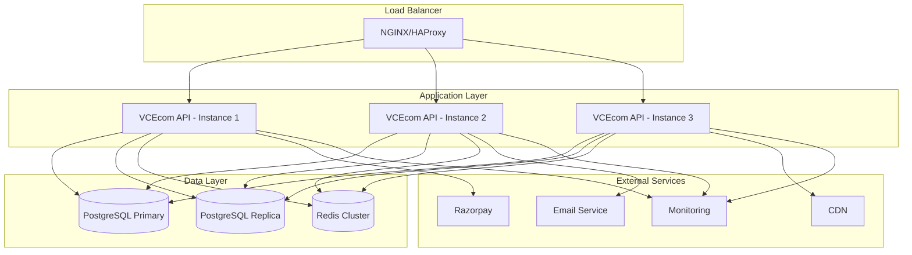

# Deployment Overview

VCEcom supports multiple deployment strategies for different environments and scaling requirements. This guide covers containerized deployment, cloud platforms, and operational considerations.

## Deployment Architecture

### Container-First Approach

VCEcom uses Docker containers for consistent deployment across environments:

```dockerfile
# Multi-stage build for optimization
FROM node:18-alpine AS builder
WORKDIR /app
COPY package*.json ./
RUN npm ci --only=production

FROM node:18-alpine AS runtime
WORKDIR /app
COPY --from=builder /app/node_modules ./node_modules
COPY . .
EXPOSE 3000
CMD ["npm", "start"]
```

### Infrastructure Components



## Environment Configurations

### Development Environment

#### Docker Compose Setup
```yaml
version: '3.8'
services:
  postgres:
    image: postgres:15
    environment:
      POSTGRES_DB: vcecom_dev
      POSTGRES_USER: vcecom
      POSTGRES_PASSWORD: password
    volumes:
      - postgres_data:/var/lib/postgresql/data
    ports:
      - "5432:5432"

  redis:
    image: redis:7-alpine
    ports:
      - "6379:6379"
    command: redis-server --appendonly yes

  backend:
    build: .
    environment:
      NODE_ENV: development
      DB_HOST: postgres
      DB_PORT: 5432
      DB_NAME: vcecom_dev
      DB_USER: vcecom
      DB_PASSWORD: password
      REDIS_HOST: redis
      REDIS_PORT: 6379
      JWT_SECRET: dev-jwt-secret
    ports:
      - "3000:3000"
    depends_on:
      - postgres
      - redis
    volumes:
      - .:/app
      - /app/node_modules

volumes:
  postgres_data:
```

#### Quick Start
```bash
# Start all services
docker-compose up -d

# Run database migrations
docker-compose exec backend npm run db:migrate

# Seed development data
docker-compose exec backend npm run db:seed

# Access the application
open http://localhost:3000
```

### Staging Environment

#### Kubernetes Deployment
```yaml
apiVersion: apps/v1
kind: Deployment
metadata:
  name: vcecom-backend
  namespace: staging
spec:
  replicas: 2
  selector:
    matchLabels:
      app: vcecom-backend
  template:
    metadata:
      labels:
        app: vcecom-backend
    spec:
      containers:
      - name: backend
        image: vcecom/backend:latest
        ports:
        - containerPort: 3000
        env:
        - name: NODE_ENV
          value: "staging"
        - name: DB_HOST
          valueFrom:
            secretKeyRef:
              name: db-secret
              key: host
        resources:
          requests:
            memory: "256Mi"
            cpu: "250m"
          limits:
            memory: "512Mi"
            cpu: "500m"
        livenessProbe:
          httpGet:
            path: /health
            port: 3000
          initialDelaySeconds: 30
          periodSeconds: 10
        readinessProbe:
          httpGet:
            path: /health/ready
            port: 3000
          initialDelaySeconds: 5
          periodSeconds: 5
```

### Production Environment

#### Infrastructure as Code
```terraform
# AWS ECS Fargate deployment
resource "aws_ecs_service" "vcecom" {
  name            = "vcecom-backend"
  cluster         = aws_ecs_cluster.main.id
  task_definition = aws_ecs_task_definition.vcecom.arn
  desired_count   = 3

  load_balancer {
    target_group_arn = aws_lb_target_group.vcecom.arn
    container_name   = "backend"
    container_port   = 3000
  }

  lifecycle {
    ignore_changes = [desired_count]
  }
}

# Auto Scaling
resource "aws_appautoscaling_target" "vcecom" {
  max_capacity       = 10
  min_capacity       = 3
  resource_id        = "service/${aws_ecs_cluster.main.name}/${aws_ecs_service.vcecom.name}"
  scalable_dimension = "ecs:service:DesiredCount"
  service_namespace  = "ecs"
}

resource "aws_appautoscaling_policy" "cpu" {
  name               = "cpu-autoscaling"
  policy_type        = "TargetTrackingScaling"
  resource_id        = aws_appautoscaling_target.vcecom.resource_id
  scalable_dimension = aws_appautoscaling_target.vcecom.scalable_dimension
  service_namespace  = aws_appautoscaling_target.vcecom.service_namespace

  target_tracking_scaling_policy_configuration {
    predefined_metric_specification {
      predefined_metric_type = "ECSServiceAverageCPUUtilization"
    }
    target_value = 70.0
  }
}
```

## Database Deployment

### PostgreSQL Configuration

#### Production PostgreSQL Settings
```sql
-- Memory configuration
ALTER SYSTEM SET shared_buffers = '256MB';
ALTER SYSTEM SET effective_cache_size = '1GB';
ALTER SYSTEM SET work_mem = '4MB';
ALTER SYSTEM SET maintenance_work_mem = '64MB';

-- Connection settings
ALTER SYSTEM SET max_connections = 200;
ALTER SYSTEM SET shared_preload_libraries = 'pg_stat_statements';

-- Logging
ALTER SYSTEM SET log_line_prefix = '%t [%p]: [%l-1] user=%u,db=%d,app=%a,client=%h ';
ALTER SYSTEM SET log_statement = 'ddl';
ALTER SYSTEM SET log_duration = on;

-- Replication (if using replicas)
ALTER SYSTEM SET wal_level = 'replica';
ALTER SYSTEM SET max_wal_senders = 10;
ALTER SYSTEM SET wal_keep_size = '1GB';
```

#### Connection Pooling with PgBouncer
```ini
[databases]
vcecom = host=postgres.example.com port=5432 dbname=vcecom

[pgbouncer]
listen_port = 6432
listen_addr = *
auth_type = md5
auth_file = /etc/pgbouncer/userlist.txt
pool_mode = transaction
server_reset_query = DISCARD ALL
max_client_conn = 1000
default_pool_size = 20
reserve_pool_size = 5
```

### Redis Deployment

#### Redis Cluster Configuration
```redis.conf
# Cluster mode
cluster-enabled yes
cluster-config-file nodes.conf
cluster-node-timeout 5000

# Persistence
appendonly yes
appendfilename "appendonly.aof"

# Memory management
maxmemory 256mb
maxmemory-policy allkeys-lru

# Security
requirepass your-redis-password
rename-command FLUSHDB ""
rename-command FLUSHALL ""
```

#### Redis Sentinel for High Availability
```sentinel.conf
sentinel monitor mymaster redis-1.example.com 6379 2
sentinel down-after-milliseconds mymaster 5000
sentinel failover-timeout mymaster 60000
sentinel parallel-syncs mymaster 1
```

## Load Balancing

### NGINX Configuration
```nginx
upstream vcecom_backend {
    least_conn;
    server backend-1.example.com:3000 weight=1;
    server backend-2.example.com:3000 weight=1;
    server backend-3.example.com:3000 weight=1;
    keepalive 32;
}

server {
    listen 80;
    server_name api.vcecom.com;

    # Security headers
    add_header X-Frame-Options "SAMEORIGIN" always;
    add_header X-XSS-Protection "1; mode=block" always;
    add_header X-Content-Type-Options "nosniff" always;
    add_header Referrer-Policy "no-referrer-when-downgrade" always;
    add_header Content-Security-Policy "default-src 'self' http: https: data: blob: 'unsafe-inline'" always;

    # Rate limiting
    limit_req zone=api burst=10 nodelay;

    location / {
        proxy_pass http://vcecom_backend;
        proxy_http_version 1.1;
        proxy_set_header Upgrade $http_upgrade;
        proxy_set_header Connection 'upgrade';
        proxy_set_header Host $host;
        proxy_set_header X-Real-IP $remote_addr;
        proxy_set_header X-Forwarded-For $proxy_add_x_forwarded_for;
        proxy_set_header X-Forwarded-Proto $scheme;
        proxy_cache_bypass $http_upgrade;

        # Timeouts
        proxy_connect_timeout 60s;
        proxy_send_timeout 60s;
        proxy_read_timeout 60s;
    }

    # Health check endpoint
    location /health {
        access_log off;
        return 200 "healthy\n";
        add_header Content-Type text/plain;
    }
}
```

### SSL/TLS Configuration
```nginx
server {
    listen 443 ssl http2;
    server_name api.vcecom.com;

    ssl_certificate /etc/ssl/certs/vcecom.crt;
    ssl_certificate_key /etc/ssl/private/vcecom.key;

    ssl_protocols TLSv1.2 TLSv1.3;
    ssl_ciphers ECDHE-RSA-AES128-GCM-SHA256:ECDHE-RSA-AES256-GCM-SHA384;
    ssl_prefer_server_ciphers off;

    # HSTS
    add_header Strict-Transport-Security "max-age=63072000" always;

    # SSL session cache
    ssl_session_cache shared:SSL:10m;
    ssl_session_timeout 10m;
}
```

## Monitoring & Observability

### Application Metrics
```typescript
// Prometheus metrics
import { collectDefaultMetrics, register, Gauge, Counter } from 'prom-client';

// Default metrics
collectDefaultMetrics();

// Custom metrics
const httpRequestDuration = new Gauge({
  name: 'http_request_duration_seconds',
  help: 'Duration of HTTP requests in seconds',
  labelNames: ['method', 'route', 'status_code'],
});

const orderCreatedTotal = new Counter({
  name: 'orders_created_total',
  help: 'Total number of orders created',
});

// Metrics endpoint
app.get('/metrics', async (req, res) => {
  res.set('Content-Type', register.contentType);
  res.end(await register.metrics());
});
```

### Infrastructure Monitoring

#### Prometheus Configuration
```yaml
global:
  scrape_interval: 15s
  evaluation_interval: 15s

scrape_configs:
  - job_name: 'vcecom-backend'
    static_configs:
      - targets: ['backend-1:3000', 'backend-2:3000', 'backend-3:3000']
    metrics_path: '/metrics'

  - job_name: 'postgres'
    static_configs:
      - targets: ['postgres:9187']  # postgres_exporter

  - job_name: 'redis'
    static_configs:
      - targets: ['redis:9121']  # redis_exporter

  - job_name: 'nginx'
    static_configs:
      - targets: ['nginx:9113']  # nginx_exporter
```

#### Grafana Dashboards
```json
{
  "dashboard": {
    "title": "VCEcom Backend",
    "tags": ["vcecom", "backend"],
    "panels": [
      {
        "title": "HTTP Request Rate",
        "type": "graph",
        "targets": [
          {
            "expr": "rate(http_requests_total[5m])",
            "legendFormat": "{{method}} {{route}}"
          }
        ]
      },
      {
        "title": "Order Creation Rate",
        "type": "graph",
        "targets": [
          {
            "expr": "rate(orders_created_total[5m])",
            "legendFormat": "Orders/min"
          }
        ]
      },
      {
        "title": "Database Connection Pool",
        "type": "graph",
        "targets": [
          {
            "expr": "pg_stat_activity_count{datname='vcecom'}",
            "legendFormat": "Active connections"
          }
        ]
      }
    ]
  }
}
```

## Security Deployment

### Environment Variables
```bash
# Database
DB_HOST=prod-postgres.example.com
DB_PASSWORD=encrypted-password-in-secrets-manager

# Redis
REDIS_PASSWORD=encrypted-redis-password

# JWT
JWT_SECRET=encrypted-jwt-secret

# External APIs
RAZORPAY_KEY_ID=encrypted-razorpay-key
RAZORPAY_KEY_SECRET=encrypted-razorpay-secret

# Monitoring
SENTRY_DSN=encrypted-sentry-dsn
```

### Secret Management

#### AWS Secrets Manager
```typescript
import { SecretsManager } from '@aws-sdk/client-secrets-manager';

const secretsManager = new SecretsManager({ region: 'us-east-1' });

async function getSecret(secretName: string): Promise<string> {
  const response = await secretsManager.getSecretValue({ SecretId: secretName });
  return response.SecretString!;
}

// Load secrets at startup
const dbPassword = await getSecret('prod/database/password');
const jwtSecret = await getSecret('prod/jwt/secret');
```

#### Kubernetes Secrets
```yaml
apiVersion: v1
kind: Secret
metadata:
  name: vcecom-secrets
type: Opaque
data:
  db-password: <base64-encoded-password>
  jwt-secret: <base64-encoded-secret>
  razorpay-key: <base64-encoded-key>

---
apiVersion: apps/v1
kind: Deployment
metadata:
  name: vcecom-backend
spec:
  template:
    spec:
      containers:
      - name: backend
        env:
        - name: DB_PASSWORD
          valueFrom:
            secretKeyRef:
              name: vcecom-secrets
              key: db-password
```

## Backup & Recovery

### Database Backup Strategy
```bash
#!/bin/bash
# Daily database backup
DATE=$(date +%Y%m%d_%H%M%S)
BACKUP_DIR="/backups"

# Create backup
pg_dump -h $DB_HOST -U $DB_USER -d $DB_NAME \
  --format=custom \
  --compress=9 \
  --file="$BACKUP_DIR/vcecom_$DATE.backup"

# Upload to S3
aws s3 cp "$BACKUP_DIR/vcecom_$DATE.backup" "s3://vcecom-backups/database/"

# Cleanup old backups (keep 30 days)
find $BACKUP_DIR -name "vcecom_*.backup" -mtime +30 -delete
```

### Redis Backup
```bash
#!/bin/bash
# Redis backup
DATE=$(date +%Y%m%d_%H%M%S)

# Create RDB snapshot
redis-cli --rdb "/backups/redis_$DATE.rdb"

# Upload to S3
aws s3 cp "/backups/redis_$DATE.rdb" "s3://vcecom-backups/redis/"
```

### Recovery Procedures
```bash
#!/bin/bash
# Database recovery
LATEST_BACKUP=$(aws s3 ls s3://vcecom-backups/database/ | sort | tail -n 1 | awk '{print $4}')

# Download backup
aws s3 cp "s3://vcecom-backups/database/$LATEST_BACKUP" /tmp/

# Restore database
pg_restore -h $DB_HOST -U $DB_USER -d $DB_NAME \
  --clean --if-exists \
  /tmp/$LATEST_BACKUP
```

## Performance Optimization

### Application Tuning

#### Node.js Configuration
```javascript
// Cluster mode for multi-core utilization
const cluster = require('cluster');
const numCPUs = require('os').cpus().length;

if (cluster.isMaster) {
  for (let i = 0; i < numCPUs; i++) {
    cluster.fork();
  }
} else {
  // Worker process
  const app = await NestFactory.create(AppModule);
  await app.listen(3000);
}
```

#### Memory Optimization
```typescript
// Increase Node.js memory limit
node --max-old-space-size=2048 dist/main.js

// Memory monitoring
const memUsage = process.memoryUsage();
if (memUsage.heapUsed > 512 * 1024 * 1024) { // 512MB
  logger.warn('High memory usage detected', { memUsage });
}
```

### Database Optimization

#### Connection Pool Configuration
```typescript
// Optimized Drizzle configuration
export const db = drizzle(pool, {
  logger: new DefaultLogger({ writer: customWriter }),
  schema,
});

// Connection pool settings
const pool = new Pool({
  host: process.env.DB_HOST,
  port: parseInt(process.env.DB_PORT || '5432'),
  database: process.env.DB_NAME,
  user: process.env.DB_USER,
  password: process.env.DB_PASSWORD,
  max: 20, // Maximum pool size
  min: 5,  // Minimum pool size
  idleTimeoutMillis: 30000,
  connectionTimeoutMillis: 2000,
});
```

### Caching Optimization

#### Cache Warming
```typescript
@Injectable()
export class CacheWarmerService {
  @Cron('0 */6 * * *') // Every 6 hours
  async warmCaches(): Promise<void> {
    // Warm product cache
    const products = await this.productService.findAll({ limit: 1000 });
    await Promise.all(products.map(p => this.cache.set(`product:${p.id}`, p)));

    // Warm category cache
    const categories = await this.categoryService.findAll();
    await this.cache.set('categories', categories);
  }
}
```

## Scaling Strategies

### Horizontal Scaling
```typescript
// Stateless application design
@Injectable()
export class ScalingService {
  // All state in external stores (Redis, PostgreSQL)
  // No local state that prevents scaling

  async getCart(sessionId: string): Promise<Cart> {
    // Cart data from Redis - works across instances
    return await this.redis.get(`cart:session:${sessionId}`);
  }

  async createOrder(orderData: OrderData): Promise<Order> {
    // Order creation is atomic and idempotent
    return await this.db.transaction(async (tx) => {
      const order = await tx.insert(orders).values(orderData).returning();
      await this.inventoryService.reserve(order.id, orderData.items);
      return order[0];
    });
  }
}
```

### Auto Scaling Policies

#### CPU-Based Scaling
```yaml
apiVersion: autoscaling/v2
kind: HorizontalPodAutoscaler
metadata:
  name: vcecom-backend-hpa
spec:
  scaleTargetRef:
    apiVersion: apps/v1
    kind: Deployment
    name: vcecom-backend
  minReplicas: 3
  maxReplicas: 10
  metrics:
  - type: Resource
    resource:
      name: cpu
      target:
        type: Utilization
        averageUtilization: 70
```

#### Custom Metrics Scaling
```yaml
# Scale based on queue length
- type: Pods
  pods:
    metric:
      name: queue_length
    target:
      type: AverageValue
      averageValue: 100
```

## Disaster Recovery

### Multi-Region Deployment
```terraform
# Primary region
resource "aws_instance" "primary" {
  provider = aws.primary
  ami = var.ami
  instance_type = "t3.large"
  # ... configuration
}

# Secondary region (standby)
resource "aws_instance" "secondary" {
  provider = aws.secondary
  ami = var.ami
  instance_type = "t3.large"
  # ... configuration
}

# Route 53 failover routing
resource "aws_route53_health_check" "primary" {
  fqdn = aws_instance.primary.public_dns
  port = 80
  type = "HTTP"
  resource_path = "/health"
  failure_threshold = 3
}

resource "aws_route53_record" "failover" {
  name = "api.vcecom.com"
  type = "A"
  set_identifier = "primary"

  failover_routing_policy {
    type = "PRIMARY"
  }

  alias {
    name = aws_lb.primary.dns_name
    zone_id = aws_lb.primary.zone_id
    evaluate_target_health = true
  }
}
```

### Backup Validation
```bash
#!/bin/bash
# Validate database backup integrity
LATEST_BACKUP=$(ls -t /backups/vcecom_*.backup | head -1)

# Test restore to temporary database
createdb vcecom_test_restore
pg_restore -d vcecom_test_restore $LATEST_BACKUP

# Run integrity checks
psql vcecom_test_restore -c "SELECT count(*) FROM orders;"
psql vcecom_test_restore -c "SELECT count(*) FROM products;"

# Clean up
dropdb vcecom_test_restore

echo "Backup validation completed successfully"
```

This deployment guide provides a comprehensive foundation for deploying VCEcom across different environments with proper scalability, monitoring, and disaster recovery capabilities.