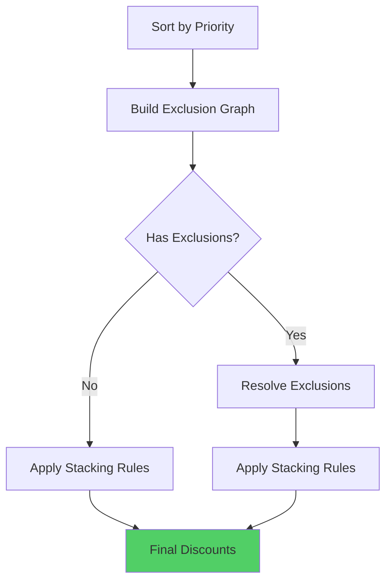

# Discount Priority & Stacking

## Priority System

Discounts are evaluated by priority number. **Lower number = Higher Priority**.

### Priority Rules

1. **Priority 1** is evaluated before **Priority 10**
2. Highest priority discount wins in conflicts
3. Priority determines order of evaluation
4. Priority applies to both product and cart discounts

### Example

```json
[
  { "code": "SAVE20", "priority": 10, "value": 20 },
  { "code": "SAVE30", "priority": 5, "value": 30 },
  { "code": "FLASH50", "priority": 1, "value": 50 }
]
```

Evaluation order: FLASH50 → SAVE30 → SAVE20

## Stacking Rules

### Stackable Discounts

When `canStack: true`:
- Multiple discounts can apply simultaneously
- All eligible stackable discounts are applied
- Discounts are applied in priority order

### Non-Stackable Discounts

When `canStack: false`:
- Only highest priority discount applies
- Other discounts are ignored
- Prevents over-discounting

## Stacking Examples

### Example 1: Stackable Discounts

```json
{
  "cart": { "subtotal": 1000 },
  "discounts": [
    { "code": "SAVE10", "priority": 10, "canStack": true, "value": 10 },
    { "code": "SAVE20", "priority": 5, "canStack": true, "value": 20 }
  ]
}
```

**Result**: Both discounts apply
- SAVE20: ₹1000 - ₹200 = ₹800
- SAVE10: ₹800 - ₹80 = ₹720
- **Final Total**: ₹720

### Example 2: Non-Stackable Discounts

```json
{
  "cart": { "subtotal": 1000 },
  "discounts": [
    { "code": "SAVE10", "priority": 10, "canStack": false, "value": 10 },
    { "code": "SAVE20", "priority": 5, "canStack": false, "value": 20 }
  ]
}
```

**Result**: Only SAVE20 applies (higher priority)
- SAVE20: ₹1000 - ₹200 = ₹800
- SAVE10: Ignored (non-stackable, lower priority)
- **Final Total**: ₹800

### Example 3: Mixed Stacking

```json
{
  "cart": { "subtotal": 1000 },
  "discounts": [
    { "code": "SAVE10", "priority": 10, "canStack": true, "value": 10 },
    { "code": "SAVE20", "priority": 5, "canStack": false, "value": 20 },
    { "code": "SAVE5", "priority": 15, "canStack": true, "value": 5 }
  ]
}
```

**Result**: SAVE20 (non-stackable) + SAVE10 and SAVE5 (stackable)
- SAVE20: ₹1000 - ₹200 = ₹800
- SAVE10: ₹800 - ₹80 = ₹720
- SAVE5: ₹720 - ₹36 = ₹684
- **Final Total**: ₹684

## Exclusion Rules

Discounts can exclude other discounts:

```json
{
  "code": "SAVE20",
  "excludedDiscountIds": ["SAVE30", "FLASH50"]
}
```

If SAVE20 is applied, SAVE30 and FLASH50 cannot be applied.

### Exclusion Resolution



## Conflict Resolution Algorithm

```typescript
function resolveConflicts(discounts: Discount[]): ResolvedDiscounts {
  // STEP 1: Sort by priority
  const sorted = discounts.sort((a, b) => a.priority - b.priority);
  
  // STEP 2: Build exclusion graph
  const exclusionMap = new Map<string, Set<string>>();
  for (const discount of sorted) {
    if (discount.excludedDiscountIds) {
      for (const excludedId of discount.excludedDiscountIds) {
        exclusionMap.get(discount.id)?.add(excludedId);
        exclusionMap.get(excludedId)?.add(discount.id); // Bidirectional
      }
    }
  }
  
  // STEP 3: Resolve mutually exclusive groups
  const resolved: Discount[] = [];
  const processed = new Set<string>();
  
  for (const discount of sorted) {
    if (processed.has(discount.id)) continue;
    
    const exclusions = exclusionMap.get(discount.id) || new Set();
    if (exclusions.size === 0) {
      // No exclusions, add directly
      resolved.push(discount);
      processed.add(discount.id);
    } else {
      // Has exclusions, resolve group
      const group = [discount];
      for (const excludedId of exclusions) {
        const excluded = sorted.find(d => d.id === excludedId);
        if (excluded && !processed.has(excludedId)) {
          group.push(excluded);
        }
      }
      // Highest priority wins
      const winner = group.reduce((prev, curr) => 
        prev.priority < curr.priority ? prev : curr
      );
      resolved.push(winner);
      group.forEach(d => processed.add(d.id));
    }
  }
  
  // STEP 4: Apply stacking rules
  return applyStackingRules(resolved);
}
```

## Best Practices

1. **Use Consistent Priorities**: Use standard values (1, 10, 100, 1000)
2. **Document Stacking**: Clearly document which discounts can stack
3. **Test Conflicts**: Test exclusion and stacking scenarios
4. **Monitor Usage**: Track which discounts are most used
5. **Avoid Over-Discounting**: Use non-stackable for high-value discounts

## Common Patterns

### Pattern 1: Exclusive High-Value Discounts

```json
{
  "code": "FLASH50",
  "priority": 1,
  "canStack": false,
  "excludedDiscountIds": ["SAVE20", "SAVE30"]
}
```

High-value discount that excludes others.

### Pattern 2: Stackable Low-Value Discounts

```json
{
  "code": "SAVE5",
  "priority": 100,
  "canStack": true
}
```

Low-value discount that can stack with others.

### Pattern 3: Category-Specific Stacking

```json
{
  "code": "ELECTRONICS10",
  "priority": 50,
  "canStack": true,
  "scope": "PRODUCT",
  "requiredCategoryIds": ["electronics"]
}
```

Category-specific discount that stacks with cart discounts.

## Edge Cases

- **Same Priority**: First encountered wins (order-dependent)
- **Circular Exclusions**: Resolved by priority (higher priority wins)
- **All Discounts Excluded**: No discounts apply
- **Stacking with Exclusion**: Exclusion takes precedence over stacking

