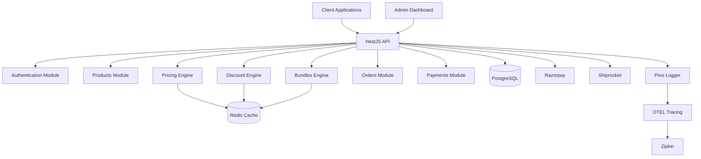

# Introduction

## What is VCEcom?

VCEcom is a lightweight, modern ecommerce backend platform built with NestJS, Drizzle ORM, and Next.js. Designed specifically for the Indian market with built-in support for Razorpay payments, Shiprocket shipping, and GST compliance.

## Key Features

- **Modular Architecture**: Clean separation of concerns with NestJS modules
- **Type-Safe Database**: Drizzle ORM with PostgreSQL for type-safe queries
- **Pricing Engine**: Flexible pricing system with price lists and customer groups
- **Discount Engine**: Deterministic discount engine with priority and stacking rules
- **Bundles Engine**: Configurable product bundles with choice sets
- **Session-Based Admin Auth**: Secure admin authentication with 2FA support
- **Redis Caching**: Multi-layer caching for performance
- **Observability**: Structured logging with Pino and distributed tracing with OpenTelemetry
- **India-Focused**: Built-in GST calculation, Razorpay integration, and Shiprocket shipping

## Architecture Overview

VCEcom follows a modular monorepo structure:

```
vcecom/
├── apps/
│   ├── backend/     # NestJS REST API
│   ├── admin/       # Next.js admin dashboard
│   └── docs/        # Documentation site
└── packages/
    └── db/          # Shared database schema and migrations
```

## High-Level Architecture



## Technology Stack

- **Backend Framework**: NestJS 11
- **Database**: PostgreSQL with Drizzle ORM
- **Cache**: Redis (ioredis)
- **Authentication**: JWT with session-based admin auth
- **Payments**: Razorpay
- **Shipping**: Shiprocket & NimbusPost
- **Logging**: Pino (structured logging)
- **Tracing**: OpenTelemetry with Zipkin
- **Admin UI**: Next.js 15
- **Documentation**: Docusaurus 3

## Getting Started

See the [Deployment Guide](/docs/deployment/overview) for setup instructions.

## Version

Current version: **v1.0.0**

This documentation covers the current stable release of VCEcom.

