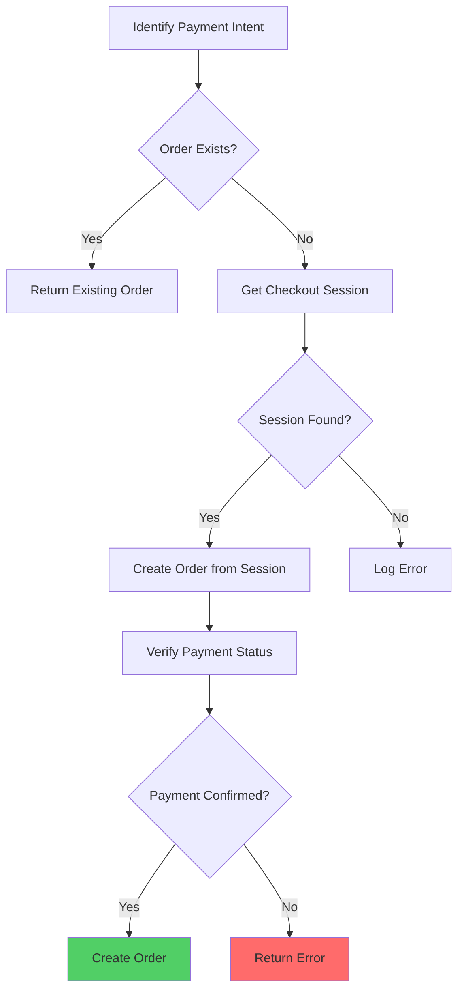

# Order Reconciliation

Order reconciliation ensures consistency between payment gateway transactions, order records, and inventory. It handles recovery from failures, identifies discrepancies, and maintains data integrity.

## Reconciliation Overview

### What is Reconciliation?

Reconciliation is the process of:
- **Matching Payments**: Verifying payment status matches order status
- **Recovering Orders**: Creating orders from successful payments that missed order creation
- **Fixing Inconsistencies**: Resolving discrepancies between systems
- **Audit Trail**: Maintaining accurate transaction records

### Reconciliation Flow



## Payment Intent Reconciliation

### Reprocess Payment Intent

```typescript
async reprocessPaymentIntent(
  paymentIntentId: string,
  provider: string = "razorpay",
): Promise<OrderResponseDto | null> {
  // Check if order already exists (idempotent)
  const existingOrderId = await this.checkoutStore.getOrderByPaymentIntent(
    provider,
    paymentIntentId,
  );

  if (existingOrderId) {
    // Order already exists, return it
    return await this.getOrder(existingOrderId);
  }

  // Find checkout session via payment intent
  const checkoutSessionId = await this.findCheckoutSessionByPaymentIntent(
    paymentIntentId,
  );

  if (!checkoutSessionId) {
    throw new NotFoundException(
      `Checkout session not found for payment intent ${paymentIntentId}`
    );
  }

  // Verify payment is confirmed
  const paymentStatus = await this.verifyPaymentStatus(
    paymentIntentId,
    provider,
  );

  if (paymentStatus !== "captured") {
    throw new BadRequestException(
      `Payment not confirmed. Status: ${paymentStatus}`
    );
  }

  // Create order from checkout session
  return await this.ordersService.finalizeOrderFromPayment(
    checkoutSessionId,
    paymentIntentId,
    provider,
  );
}
```

### Idempotent Reconciliation

```typescript
// Safe to call multiple times
// Returns existing order if already created
// Creates order only if missing
const order = await reconciliationService.reprocessPaymentIntent(
  paymentIntentId,
);
```

## Finding Checkout Sessions

### Reverse Lookup

```typescript
async findCheckoutSessionByPaymentIntent(
  paymentIntentId: string,
): Promise<string | null> {
  // Try reverse lookup first
  const reverseKey = `payment:intent:by-id:${paymentIntentId}`;
  const checkoutSessionId = await this.client.get(reverseKey);
  
  if (checkoutSessionId) {
    return checkoutSessionId;
  }

  // Fallback: Search all checkout sessions
  // (less efficient, but handles edge cases)
  return await this.searchCheckoutSessionsByPaymentIntent(paymentIntentId);
}
```

### Payment Intent Lookup

```typescript
async getOrderByPaymentIntent(
  provider: string,
  paymentIntentId: string,
): Promise<string | null> {
  // Check if order exists for this payment intent
  const [order] = await db
    .select({ id: orders.id })
    .from(orders)
    .where(
      and(
        eq(orders.razorpayOrderId, paymentIntentId),
        eq(orders.status, "confirmed"), // Only confirmed orders
      ),
    )
    .limit(1);

  return order?.id || null;
}
```

## Payment Status Verification

### Verify Payment Status

```typescript
async verifyPaymentStatus(
  paymentIntentId: string,
  provider: string,
): Promise<PaymentStatus> {
  if (provider === "razorpay") {
    // Get payment details from Razorpay
    const razorpayOrder = await this.razorpay.orders.fetch(paymentIntentId);
    
    // Get payments for this order
    const payments = await this.razorpay.orders.fetchPayments(
      paymentIntentId,
    );

    // Check if any payment is captured
    const capturedPayment = payments.items.find(
      (p) => p.status === "captured",
    );

    return capturedPayment ? "captured" : "pending";
  }

  throw new BadRequestException(`Unsupported provider: ${provider}`);
}
```

## Reconciliation Scenarios

### Scenario 1: Webhook Missed

**Problem**: Payment webhook was missed or failed, order not created.

**Solution**:
```typescript
// Admin manually reconciles payment intent
const order = await reconciliationService.reprocessPaymentIntent(
  paymentIntentId,
);
```

### Scenario 2: Order Creation Failed

**Problem**: Order creation started but failed mid-process.

**Solution**:
```typescript
// Checkout session exists, payment confirmed
// Reconciliation recreates order from session
const order = await reconciliationService.reprocessPaymentIntent(
  paymentIntentId,
);
```

### Scenario 3: Duplicate Payment Intent

**Problem**: Multiple payment intents created for same checkout.

**Solution**:
```typescript
// Idempotent reconciliation prevents duplicates
// Returns existing order if already created
const order = await reconciliationService.reprocessPaymentIntent(
  paymentIntentId,
);
```

## Inventory Reconciliation

### Reservation Reconciliation

```typescript
async reconcileInventoryReservations(): Promise<void> {
  // Find all variants with reservations
  const variants = await this.getAllVariantsWithReservations();
  
  for (const variantId of variants) {
    // Get aggregated reserved count
    const aggregatedReserved = await this.getReservedInventory(variantId);
    
    // Get all individual reservations
    const reservations = await this.getAllReservations(variantId);
    const totalFromReservations = sumReservations(reservations);
    
    // Fix inconsistencies
    if (aggregatedReserved !== totalFromReservations) {
      await this.correctReservedCount(variantId, totalFromReservations);
    }
  }
}
```

### Reservation Cleanup

```typescript
async cleanupExpiredReservations(): Promise<void> {
  // Find expired reservations
  const expiredReservations = await this.findExpiredReservations();
  
  for (const reservation of expiredReservations) {
    // Release reservation
    await this.releaseInventory(
      reservation.cartId,
      reservation.variantId,
      reservation.quantity,
    );
  }
}
```

## Order Status Reconciliation

### Status Consistency Check

```typescript
async reconcileOrderStatuses(): Promise<ReconciliationReport> {
  const inconsistencies: OrderInconsistency[] = [];
  
  // Find orders with payment but wrong status
  const orders = await this.getOrdersWithPayments();
  
  for (const order of orders) {
    const payment = await this.getPaymentByOrderId(order.id);
    
    if (payment.status === "captured" && order.status === "pending") {
      inconsistencies.push({
        orderId: order.id,
        issue: "Payment captured but order still pending",
        fix: "Update order status to confirmed",
      });
    }
  }
  
  return {
    inconsistencies,
    fixed: await this.fixInconsistencies(inconsistencies),
  };
}
```

## Automated Reconciliation

### Scheduled Reconciliation

```typescript
@Cron("0 */6 * * *") // Every 6 hours
async scheduledReconciliation(): Promise<void> {
  this.logger.info("Starting scheduled reconciliation");
  
  // Reconcile payment intents
  await this.reconcilePaymentIntents();
  
  // Reconcile inventory
  await this.reconcileInventoryReservations();
  
  // Reconcile order statuses
  await this.reconcileOrderStatuses();
  
  this.logger.info("Scheduled reconciliation completed");
}
```

### Payment Intent Reconciliation

```typescript
async reconcilePaymentIntents(): Promise<void> {
  // Find payment intents without orders
  const orphanedIntents = await this.findOrphanedPaymentIntents();
  
  for (const intent of orphanedIntents) {
    try {
      // Verify payment status
      const status = await this.verifyPaymentStatus(intent.id, "razorpay");
      
      if (status === "captured") {
        // Attempt reconciliation
        await this.reprocessPaymentIntent(intent.id, "razorpay");
      }
    } catch (error) {
      this.logger.error(
        `Failed to reconcile payment intent ${intent.id}`,
        error,
      );
    }
  }
}
```

## Manual Reconciliation

### Admin Reconciliation Endpoint

```http
POST /admin/orders/reconcile/{paymentIntentId}?provider=razorpay
```

**Response**:
```json
{
  "orderId": "order-123",
  "status": "created",
  "message": "Order created successfully"
}
```

### Reconciliation UI

```typescript
// Admin can manually reconcile payment intents
async reconcilePaymentIntent(paymentIntentId: string) {
  try {
    const order = await reconciliationService.reprocessPaymentIntent(
      paymentIntentId,
    );
    toast.success("Order reconciled successfully");
    return order;
  } catch (error) {
    toast.error(error.message || "Reconciliation failed");
    throw error;
  }
}
```

## Reconciliation Reports

### Report Structure

```typescript
interface ReconciliationReport {
  timestamp: Date;
  paymentIntentsReconciled: number;
  ordersCreated: number;
  inconsistenciesFound: number;
  inconsistenciesFixed: number;
  errors: ReconciliationError[];
}
```

### Generating Reports

```typescript
async generateReconciliationReport(): Promise<ReconciliationReport> {
  const report: ReconciliationReport = {
    timestamp: new Date(),
    paymentIntentsReconciled: 0,
    ordersCreated: 0,
    inconsistenciesFound: 0,
    inconsistenciesFixed: 0,
    errors: [],
  };
  
  // Run reconciliation
  const result = await this.reconcilePaymentIntents();
  
  report.paymentIntentsReconciled = result.processed;
  report.ordersCreated = result.ordersCreated;
  report.inconsistenciesFound = result.inconsistencies.length;
  report.inconsistenciesFixed = result.fixed;
  
  return report;
}
```

## Error Handling

### Reconciliation Failures

```typescript
try {
  await this.reprocessPaymentIntent(paymentIntentId);
} catch (error) {
  // Log error with context
  this.logger.error(
    createErrorContext(this.contextService, "reconciliation", error, {
      paymentIntentId,
    }),
    "Reconciliation failed",
  );
  
  // Notify admin
  await this.notificationsService.notifyAdmin({
    type: "RECONCILIATION_FAILED",
    paymentIntentId,
    error: error.message,
  });
}
```

## Best Practices

1. **Idempotency**: Always make reconciliation idempotent
2. **Logging**: Log all reconciliation actions
3. **Monitoring**: Monitor reconciliation success rates
4. **Automation**: Schedule regular reconciliation
5. **Manual Override**: Allow manual reconciliation for edge cases

## Edge Cases

### Checkout Session Expired

- Checkout session may have expired
- Payment intent still valid
- Reconciliation uses payment gateway data

### Multiple Payment Attempts

- Multiple payments for same intent
- Reconciliation handles gracefully
- Uses first successful payment

### Partial Order Creation

- Order partially created
- Reconciliation completes order
- Handles partial data gracefully

