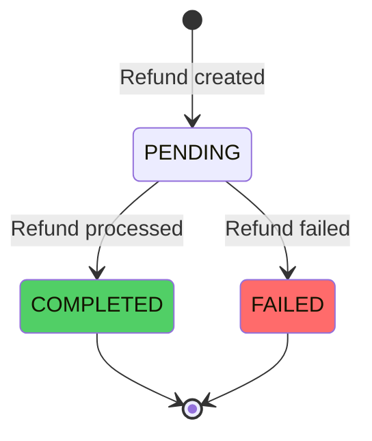
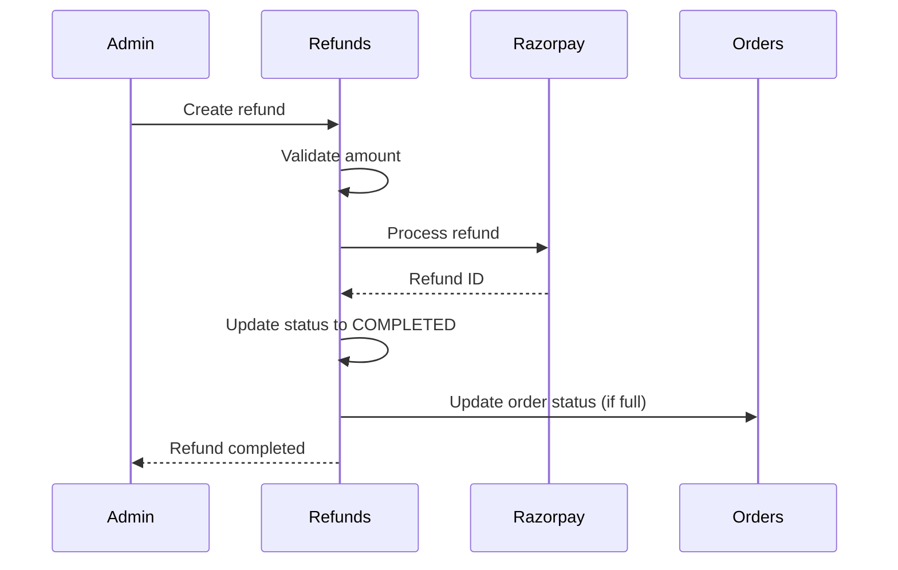

# Order Refunds

The refund system handles processing refunds for orders, including full and partial refunds, payment gateway integration, and refund status tracking.

## Refund Overview

### Refund States



### Refund Status

```typescript
enum RefundStatus {
  PENDING = "pending",    // Refund created, processing
  COMPLETED = "completed", // Refund processed successfully
  FAILED = "failed",      // Refund failed
}
```

## Refund Data Structure

### Refund Entity

```typescript
interface Refund {
  id: string;
  orderId: string;
  amount: number;              // Refund amount in rupees
  reason: string;              // Refund reason
  status: RefundStatus;
  providerRefundId?: string;  // Payment gateway refund ID
  processedAt?: Date;          // When refund was processed
  createdAt: Date;
  updatedAt: Date;
}
```

## Creating Refunds

### Refund Creation

```typescript
async create(
  orderId: string,
  amount: number,
  reason: string,
): Promise<Refund> {
  // Validate refund amount
  if (amount <= 0) {
    throw new BadRequestException("Refund amount must be greater than 0");
  }

  if (amount < MIN_REFUND_AMOUNT_INR) {
    throw new BadRequestException(
      `Refund amount must be at least ${MIN_REFUND_AMOUNT_INR} INR`
    );
  }

  // Get order
  const order = await this.getOrder(orderId);
  
  // Calculate refundable amount
  const refundableAmount = this.calculateRefundableAmount(order, amount);
  
  // Validate amount doesn't exceed refundable
  if (amount > refundableAmount) {
    throw new BadRequestException(
      `Refund amount exceeds refundable amount: ${refundableAmount}`
    );
  }

  // Create refund record
  const [refund] = await db
    .insert(refunds)
    .values({
      orderId,
      amount,
      reason,
      status: RefundStatus.PENDING,
    })
    .returning();

  // Process refund via payment gateway
  await this.processRefund(refund);

  return refund;
}
```

## Refundable Amount Calculation

### Refundable Amount Logic

```typescript
function calculateRefundableAmount(
  order: Order,
  requestedAmount: number,
): number {
  // Get existing refunds
  const existingRefunds = await this.getRefundsByOrderId(order.id);
  const totalRefunded = existingRefunds.reduce(
    (sum, refund) => sum + refund.amount,
    0,
  );

  // Payment fees are typically NOT refunded by payment gateways
  // Full refund: refund entire order total (includes fee)
  // Partial refund: exclude payment fee from refundable amount
  const paymentFeeInRupees = (order.paymentFee || 0) / 100;
  const isFullRefund = requestedAmount >= order.total - totalRefunded;
  
  const refundableAmount = isFullRefund
    ? order.total // Full refund includes fee
    : order.total - paymentFeeInRupees; // Partial refund excludes fee

  const maxRefundable = refundableAmount * MAX_REFUND_AMOUNT_MULTIPLIER;
  const remainingRefundable = maxRefundable - totalRefunded;

  return remainingRefundable;
}
```

### Refund Constraints

- **Minimum Amount**: ₹1 INR minimum refund
- **Maximum Amount**: Cannot exceed order total (with multiplier)
- **Payment Fee**: Excluded from partial refunds, included in full refunds

## Refund Processing

### Payment Gateway Integration

```typescript
async processRefund(refund: Refund): Promise<void> {
  // Get order and payment details
  const order = await this.getOrder(refund.orderId);
  const payment = await this.getPaymentByOrderId(order.id);

  if (!payment || payment.status !== "captured") {
    throw new BadRequestException(
      "Cannot refund order without captured payment"
    );
  }

  try {
    // Process refund via Razorpay
    const razorpayRefund = await this.razorpay.payments.refund(
      payment.providerPaymentId,
      {
        amount: Math.round(refund.amount * 100), // Convert to paise
        notes: {
          refund_id: refund.id,
          order_id: order.id,
          reason: refund.reason,
        },
      },
    );

    // Update refund status
    await db
      .update(refunds)
      .set({
        status: RefundStatus.COMPLETED,
        providerRefundId: razorpayRefund.id,
        processedAt: new Date(),
      })
      .where(eq(refunds.id, refund.id));

    // Update order status if full refund
    const totalRefunded = await this.getTotalRefunded(order.id);
    if (totalRefunded >= order.total) {
      await this.updateOrderStatus(order.id, OrderStatus.REFUNDED);
    }

    // Add timeline event
    await this.timelineService.addEvent(order.id, {
      type: TimelineEventType.REFUNDED,
      message: `Refund of ₹${refund.amount} processed`,
      metadata: {
        refundId: refund.id,
        amount: refund.amount,
        reason: refund.reason,
      },
    });

  } catch (error) {
    // Update refund status to failed
    await db
      .update(refunds)
      .set({
        status: RefundStatus.FAILED,
      })
      .where(eq(refunds.id, refund.id));

    throw error;
  }
}
```

## Full vs Partial Refunds

### Full Refund

```typescript
// Full refund: refund entire order total
const fullRefundAmount = order.total;

// Includes payment fee
// Order status updated to REFUNDED
// All inventory restored (if applicable)
```

### Partial Refund

```typescript
// Partial refund: refund specific amount
const partialRefundAmount = 500; // Less than order total

// Payment fee excluded from refundable amount
// Order status remains unchanged (unless fully refunded)
// Inventory handling depends on business rules
```

## Refund Reasons

### Common Refund Reasons

```typescript
enum RefundReason {
  CUSTOMER_REQUEST = "Customer requested refund",
  PRODUCT_DEFECT = "Product defect",
  WRONG_ITEM = "Wrong item received",
  SIZE_MISMATCH = "Size mismatch",
  DELIVERY_DELAY = "Delivery delay",
  DUPLICATE_ORDER = "Duplicate order",
  OTHER = "Other",
}
```

### Refund Reason Validation

```typescript
if (!reason || reason.trim().length === 0) {
  throw new BadRequestException("Refund reason is required");
}
```

## Refund Status Updates

### Status Update Flow



## Multiple Refunds

### Handling Multiple Refunds

```typescript
// Order can have multiple refunds
const refunds = await this.getRefundsByOrderId(orderId);

// Calculate total refunded
const totalRefunded = refunds.reduce(
  (sum, refund) => sum + refund.amount,
  0,
);

// Check if fully refunded
if (totalRefunded >= order.total) {
  await this.updateOrderStatus(orderId, OrderStatus.REFUNDED);
}
```

### Refund Limits

```typescript
// Maximum refundable amount with multiplier
const maxRefundable = refundableAmount * MAX_REFUND_AMOUNT_MULTIPLIER;

// Check remaining refundable
const remainingRefundable = maxRefundable - totalRefunded;

if (amount > remainingRefundable) {
  throw new BadRequestException(
    `Refund amount exceeds remaining refundable: ${remainingRefundable}`
  );
}
```

## Inventory Handling

### Refund Inventory Rules

```typescript
async handleRefundInventory(orderId: string, refund: Refund): Promise<void> {
  const order = await this.getOrder(orderId);
  
  // Business rule: Restore inventory for full refunds
  if (refund.amount >= order.total) {
    // Restore inventory for all items
    for (const item of order.items) {
      await this.inventoryStore.incrementInventory(
        item.productVariantId,
        item.quantity,
      );
    }
  }
  
  // Partial refunds: Inventory handling depends on business rules
  // Typically, inventory is not restored for partial refunds
}
```

## Refund Timeline

### Timeline Events

```typescript
// Refund created
await this.timelineService.addEvent(orderId, {
  type: TimelineEventType.REFUNDED,
  message: `Refund of ₹${amount} requested`,
  metadata: {
    refundId: refund.id,
    amount: refund.amount,
    reason: refund.reason,
  },
});

// Refund processed
await this.timelineService.addEvent(orderId, {
  type: TimelineEventType.REFUNDED,
  message: `Refund of ₹${amount} processed successfully`,
  metadata: {
    refundId: refund.id,
    providerRefundId: refund.providerRefundId,
  },
});
```

## API Endpoints

### Create Refund

```http
POST /admin/orders/{orderId}/refund
Content-Type: application/json

{
  "amount": 500,
  "reason": "Product defect"
}
```

**Response**:
```json
{
  "id": "refund-123",
  "orderId": "order-456",
  "amount": 500,
  "reason": "Product defect",
  "status": "pending",
  "createdAt": "2024-12-18T10:00:00Z"
}
```

### Get Refunds for Order

```http
GET /admin/orders/{orderId}/refunds
```

**Response**:
```json
{
  "refunds": [
    {
      "id": "refund-123",
      "amount": 500,
      "reason": "Product defect",
      "status": "completed",
      "processedAt": "2024-12-18T10:05:00Z"
    }
  ],
  "totalRefunded": 500,
  "remainingRefundable": 500
}
```

## Error Handling

### Refund Validation Errors

```typescript
// Amount validation
if (amount <= 0) {
  throw new BadRequestException("Refund amount must be greater than 0");
}

// Minimum amount
if (amount < MIN_REFUND_AMOUNT_INR) {
  throw new BadRequestException(
    `Refund amount must be at least ${MIN_REFUND_AMOUNT_INR} INR`
  );
}

// Exceeds refundable
if (amount > remainingRefundable) {
  throw new BadRequestException(
    `Refund amount exceeds refundable amount: ${remainingRefundable}`
  );
}
```

### Payment Gateway Errors

```typescript
try {
  await this.processRefund(refund);
} catch (error) {
  // Update refund status to failed
  await this.updateRefundStatus(refund.id, RefundStatus.FAILED);
  
  // Log error
  this.logger.error("Refund processing failed", error);
  
  // Notify admin
  await this.notificationsService.notifyAdmin({
    type: "REFUND_FAILED",
    refundId: refund.id,
    error: error.message,
  });
}
```

## Refund Reconciliation

### Reconciliation Process

```typescript
async reconcileRefunds(): Promise<void> {
  // Find pending refunds
  const pendingRefunds = await this.getPendingRefunds();
  
  for (const refund of pendingRefunds) {
    // Check payment gateway status
    const gatewayStatus = await this.checkGatewayRefundStatus(refund);
    
    if (gatewayStatus === "completed" && refund.status !== "completed") {
      // Update refund status
      await this.updateRefundStatus(refund.id, RefundStatus.COMPLETED);
    }
  }
}
```

## Best Practices

1. **Amount Validation**: Always validate refund amounts
2. **Reason Required**: Require refund reasons for tracking
3. **Status Tracking**: Track refund status accurately
4. **Error Handling**: Handle payment gateway errors gracefully
5. **Timeline Events**: Record all refund events in timeline

## Edge Cases

### Refund After Order Cancellation

- Refunds can be created for cancelled orders
- Payment must be captured
- Inventory already restored during cancellation

### Refund for Partial Order

- Handle refunds for specific items
- Calculate refund amount for items only
- Update order status appropriately

### Refund Timeout

- Handle refund processing timeouts
- Retry failed refunds
- Manual intervention for stuck refunds

