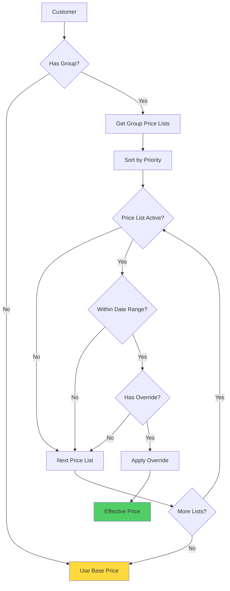

# Customer Groups

## Overview

Customer groups segment customers for pricing purposes. Each group can have multiple price lists associated with it, allowing for flexible pricing strategies.

## Customer Group Structure

```typescript
interface CustomerGroup {
  id: string;
  name: string;
  description?: string;
  isActive: boolean;
  priceLists: Array<{
    priceListId: string;
    priority: number; // Lower = higher priority
  }>;
  createdAt: Date;
  updatedAt: Date;
}
```

## Use Cases

### VIP Customers

```json
{
  "name": "VIP",
  "description": "VIP customers with 20% discount",
  "priceLists": [
    {
      "priceListId": "vip-pricing",
      "priority": 1
    }
  ]
}
```

### Wholesale Customers

```json
{
  "name": "Wholesale",
  "description": "Bulk purchase pricing",
  "priceLists": [
    {
      "priceListId": "wholesale-pricing",
      "priority": 1
    }
  ]
}
```

### Regular Customers

```json
{
  "name": "Regular",
  "description": "Standard pricing",
  "priceLists": []
}
```

## Price List Priority

When a customer group has multiple price lists:

1. Price lists are evaluated in priority order (lower number = higher priority)
2. First matching override wins
3. If no override found, check next price list
4. If no price lists match, use base price

## Assigning Customers to Groups

Customers are assigned to groups via the `customers` table:

```sql
ALTER TABLE customers
ADD COLUMN customer_group_id UUID REFERENCES customer_groups(id);
```

## Pricing Resolution Flow



## API Endpoints

- `GET /admin/pricing/customer-groups` - List all customer groups
- `POST /admin/pricing/customer-groups` - Create customer group
- `GET /admin/pricing/customer-groups/:id` - Get customer group
- `PATCH /admin/pricing/customer-groups/:id` - Update customer group
- `DELETE /admin/pricing/customer-groups/:id` - Delete customer group
- `POST /admin/pricing/customer-groups/:id/price-lists` - Add price list to group
- `DELETE /admin/pricing/customer-groups/:id/price-lists/:priceListId` - Remove price list from group

## Creating a Customer Group

```http
POST /admin/pricing/customer-groups
Content-Type: application/json

{
  "name": "VIP",
  "description": "VIP customers",
  "isActive": true,
  "priceLists": [
    {
      "priceListId": "vip-pricing-id",
      "priority": 1
    }
  ]
}
```

## Assigning Price Lists

Add a price list to a customer group:

```http
POST /admin/pricing/customer-groups/:groupId/price-lists
Content-Type: application/json

{
  "priceListId": "price-list-id",
  "priority": 1
}
```

## Default Group

Customers without an assigned group use base prices (no price list overrides).

## Caching

Customer groups are cached in Redis:

- **Cache Key**: `pricing:customer-group:{id}`
- **TTL**: 1 hour
- **Invalidation**: On group create/update/delete

## Best Practices

1. **Clear Naming**: Use descriptive names (VIP, Wholesale, Regular)
2. **Consistent Priorities**: Use standard priority values (1, 10, 100)
3. **Test Pricing**: Verify price calculations for each group
4. **Monitor Usage**: Track which groups are most used
5. **Document Rules**: Document pricing rules for each group

## Edge Cases

- **No Group**: Customer uses base prices
- **Inactive Group**: Treated as no group
- **Empty Price Lists**: Uses base prices
- **All Price Lists Inactive**: Uses base prices
- **No Matching Overrides**: Uses base prices

