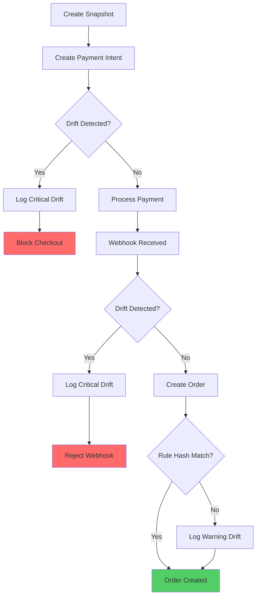

# Pricing Drift Detection

## Overview

Pricing drift detection monitors discrepancies between expected and actual pricing throughout the checkout and order creation process.

## What is Pricing Drift?

Pricing drift occurs when:
- Snapshot price doesn't match current pricing
- Payment amount doesn't match snapshot price
- Price lists change during checkout
- Pricing engine version changes

## Drift Detection Points

### 1. Payment Intent Creation

Detects drift between snapshot and payment intent amount:

```typescript
async detectPaymentIntentDrift(
  checkoutId: string,
  engineTotal: number,
  paymentIntentAmount: number,
  snapshot: PricingSnapshot
): Promise<void> {
  const tolerance = 0.01; // ₹0.01 tolerance
  const difference = Math.abs(engineTotal - paymentIntentAmount);
  
  if (difference > tolerance) {
    await auditService.logDrift({
      checkoutId,
      expected: paymentIntentAmount,
      actual: engineTotal,
      driftDetails: {
        reason: "Engine total does not match payment intent amount",
        mismatchType: "PAYMENT_INTENT_AMOUNT_MISMATCH"
      },
      severity: "CRITICAL"
    });
    
    throw new BadRequestException("Pricing drift detected");
  }
}
```

### 2. Webhook Processing

Detects drift between snapshot and webhook payment amount:

```typescript
async detectWebhookDrift(
  checkoutId: string,
  paymentIntentId: string,
  snapshot: PricingSnapshot,
  webhookPaymentAmount: number
): Promise<void> {
  const tolerance = 0.01;
  const difference = Math.abs(snapshot.totalEffectivePrice - webhookPaymentAmount);
  
  if (difference > tolerance) {
    await auditService.logDrift({
      checkoutId,
      paymentIntentId,
      expected: webhookPaymentAmount,
      actual: snapshot.totalEffectivePrice,
      driftDetails: {
        reason: "Snapshot total does not match webhook payment amount",
        mismatchType: "WEBHOOK_PAYMENT_AMOUNT_MISMATCH"
      },
      severity: "CRITICAL"
    });
    
    throw new BadRequestException("Pricing drift detected");
  }
}
```

### 3. Order Creation

Detects drift in rule hash and engine version:

```typescript
async detectOrderCreationDrift(
  orderId: string,
  snapshot: PricingSnapshot,
  currentPriceLists: PriceList[]
): Promise<void> {
  const currentHash = computePriceListHash(currentPriceLists);
  
  if (snapshot.ruleHash !== currentHash) {
    await auditService.logDrift({
      orderId,
      driftDetails: {
        reason: "Price list rules changed between snapshot and order creation",
        mismatchType: "RULE_HASH_MISMATCH",
        snapshotHash: snapshot.ruleHash,
        currentHash
      },
      severity: "WARNING" // Warning, not critical (price lists may have changed)
    });
  }
  
  if (snapshot.engineVersion !== PRICING_ENGINE_VERSION) {
    await auditService.logDrift({
      orderId,
      driftDetails: {
        reason: "Pricing engine version changed",
        mismatchType: "ENGINE_VERSION_MISMATCH",
        snapshotVersion: snapshot.engineVersion,
        currentVersion: PRICING_ENGINE_VERSION
      },
      severity: "WARNING"
    });
  }
}
```

## Drift Severity Levels

### CRITICAL

Blocks checkout or order creation:
- Payment amount mismatch
- Snapshot validation failure
- Engine calculation error

### WARNING

Logs drift but allows operation:
- Rule hash mismatch (price lists changed)
- Engine version mismatch (engine updated)
- Minor calculation differences

## Drift Report

Admin can view drift reports:

```http
GET /admin/pricing/drift-report?dateFrom=2025-12-01&severity=CRITICAL
```

Response:

```json
{
  "data": [
    {
      "id": "drift-123",
      "checkoutId": "checkout-456",
      "orderId": "order-789",
      "severity": "CRITICAL",
      "expected": 1000.00,
      "actual": 999.99,
      "difference": 0.01,
      "driftDetails": {
        "reason": "Payment amount mismatch",
        "mismatchType": "PAYMENT_INTENT_AMOUNT_MISMATCH"
      },
      "timestamp": "2025-12-18T10:30:00Z"
    }
  ],
  "total": 1,
  "page": 1,
  "limit": 50
}
```

## Drift Detection Flow



## Tolerance

Default tolerance: **₹0.01** (1 paise)

Allows for minor rounding differences while catching significant drift.

## Audit Logging

All drift events are logged to `pricing_audit_logs` table:

```sql
CREATE TABLE pricing_audit_logs (
  id UUID PRIMARY KEY,
  event TEXT NOT NULL,
  checkout_id UUID,
  order_id UUID,
  variant_id UUID,
  price_list_id UUID,
  customer_group_id UUID,
  expected_amount DECIMAL(10,2),
  actual_amount DECIMAL(10,2),
  drift_details JSONB,
  severity TEXT,
  timestamp TIMESTAMP NOT NULL
);
```

## Best Practices

1. **Monitor Regularly**: Review drift reports weekly
2. **Investigate Critical**: Investigate all CRITICAL drift events
3. **Set Alerts**: Alert on CRITICAL drift events
4. **Track Trends**: Monitor drift trends over time
5. **Document Changes**: Document price list changes

## Common Causes

1. **Price List Updates**: Price lists changed during checkout
2. **Rounding Errors**: Minor rounding differences
3. **Engine Updates**: Pricing engine version changed
4. **Bundle Changes**: Bundle definitions changed
5. **Concurrent Modifications**: Multiple price list updates

## Edge Cases

- **Zero Tolerance**: Some scenarios require zero tolerance
- **Negative Drift**: Drift can be negative (over-charge)
- **Multiple Drifts**: Multiple drift types can occur simultaneously
- **Missing Snapshot**: Handle gracefully if snapshot missing

