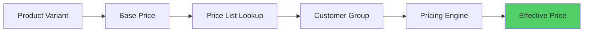

# Pricing System Overview

## Architecture

The pricing system provides flexible, multi-tier pricing with price lists, customer groups, and snapshot versioning.

## Key Components

- **Price Lists**: Collections of prices for specific customer groups
- **Customer Groups**: Segmentation for pricing (e.g., VIP, Wholesale)
- **Pricing Engine**: Calculates effective prices based on rules
- **Pricing Snapshots**: Immutable price records for order history
- **Drift Detection**: Monitors price changes over time

## Pricing Flow



## Price Resolution

1. **Base Price**: Product variant's base price
2. **Price List**: Lookup price list for customer's group
3. **Override**: Price list may override base price
4. **Final Price**: Effective price returned

## Features

- Multi-tier pricing (base, price list, customer group)
- Price list versioning
- Snapshot creation for orders
- Drift detection and reporting
- Redis caching for performance

## Database Schema

### price_lists

```sql
CREATE TABLE price_lists (
  id UUID PRIMARY KEY,
  name TEXT NOT NULL,
  customer_group_id UUID REFERENCES customer_groups(id),
  is_active BOOLEAN DEFAULT true,
  created_at TIMESTAMP NOT NULL
);
```

### price_list_items

```sql
CREATE TABLE price_list_items (
  id UUID PRIMARY KEY,
  price_list_id UUID REFERENCES price_lists(id),
  variant_id UUID REFERENCES product_variants(id),
  price DECIMAL(10,2) NOT NULL,
  created_at TIMESTAMP NOT NULL
);
```

## API Endpoints

- `GET /pricing/calculate` - Calculate price for variant
- `GET /admin/pricing/price-lists` - List price lists
- `POST /admin/pricing/price-lists` - Create price list
- `GET /admin/pricing/drift-report` - Get drift report

## Caching Strategy

- **Redis Cache**: Price calculations cached with TTL
- **Cache Key**: `pricing:variant:{variantId}:group:{groupId}`
- **Invalidation**: On price list updates

