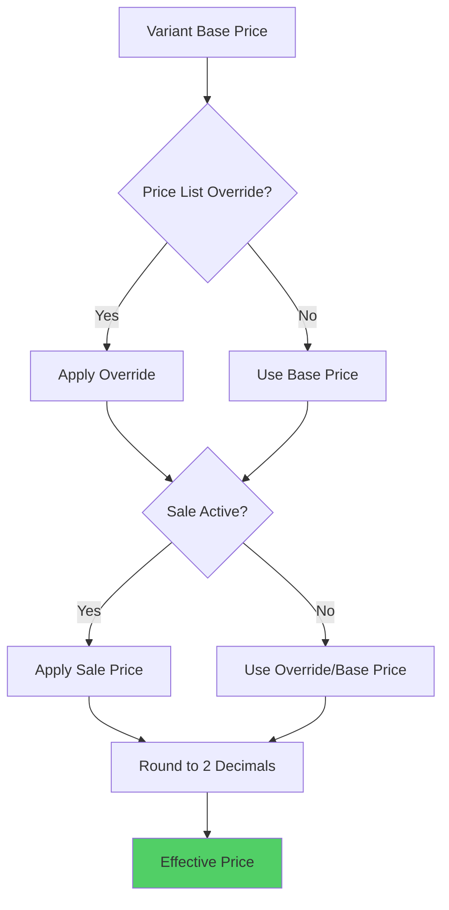

# Pricing Engine

## Overview

The pricing engine is a pure, deterministic function that calculates effective prices for product variants based on base prices, price lists, and customer groups.

## Deterministic Behavior

The pricing engine is **deterministic**: same input always produces same output. This ensures:
- Consistent pricing across requests
- Reliable snapshot creation
- Accurate drift detection

## Price Resolution Flow



## Price List Override Resolution

Price lists can override prices at three levels of specificity:

1. **VARIANT** - Most specific, highest priority
2. **PRODUCT** - Medium specificity
3. **CATEGORY** - Least specific, lowest priority

When multiple overrides exist, the most specific wins.

### Override Types

- **FIXED**: Replace price with fixed amount
- **PERCENTAGE**: Apply percentage discount to base price

### Example

```typescript
// Base price: ₹1000
// Price list has:
// - Category override: -10% → ₹900
// - Product override: -15% → ₹850
// - Variant override: ₹800 (fixed)

// Result: ₹800 (variant override wins)
```

## Sale Price Application

Sale prices are applied **after** price list overrides:

1. Check if sale is active (current time between `saleStartDate` and `saleEndDate`)
2. If active, use `salePrice` if lower than override/base price
3. Ensure price never goes below 0

## Pricing Engine Input

```typescript
interface PricingEngineInput {
  variants: VariantPricingInput[];
  customer: {
    id: string;
    customerGroupId: string | null;
  } | null;
  priceLists: PriceList[]; // Pre-filtered for customer group
  now: Date; // For sale date validation
}
```

## Pricing Engine Output

```typescript
interface PricingEngineResult {
  variantPrices: VariantPricingResult[];
  totalBasePrice: number;
  totalEffectivePrice: number;
  appliedPriceListIds: string[];
}

interface VariantPricingResult {
  variantId: string;
  basePrice: number;
  compareAtPrice?: number;
  effectivePrice: number;
  appliedPriceListId?: string;
  appliedPriceListName?: string;
  salePrice?: number;
  isOnSale: boolean;
  priceListOverrides: PriceListOverride[];
}
```

## Algorithm

```typescript
function runPricingEngine(input: PricingEngineInput): PricingEngineResult {
  // STEP 1: Resolve price list overrides (most specific wins)
  const overrides = resolvePriceListOverrides(variant, priceLists);
  const bestOverride = overrides[0]; // Most specific
  
  // STEP 2: Calculate price after override
  let priceAfterOverride = variant.basePrice;
  if (bestOverride) {
    if (bestOverride.overrideType === "FIXED") {
      priceAfterOverride = bestOverride.overrideValue;
    } else if (bestOverride.overrideType === "PERCENTAGE") {
      priceAfterOverride = variant.basePrice * (1 - bestOverride.overrideValue / 100);
    }
  }
  
  // STEP 3: Apply scheduled sale price (if active)
  const saleActive = isSaleActive(variant, now);
  const effectivePrice = saleActive && variant.salePrice
    ? Math.max(0, roundToTwoDecimals(variant.salePrice))
    : Math.max(0, roundToTwoDecimals(priceAfterOverride));
  
  return { effectivePrice, ... };
}
```

## Rounding

All prices are rounded to 2 decimal places using banker's rounding (round half to even) to ensure consistent results.

## Performance

- **Pure Function**: No side effects, easily cacheable
- **Redis Caching**: Results cached with customer group + variant ID as key
- **Bundle Pricing**: Pre-computed pricing bundles for faster lookups

## Edge Cases

- **No Price List**: Uses base price
- **Multiple Price Lists**: Highest priority wins, then most specific override
- **Expired Sale**: Sale price ignored if outside date range
- **Negative Prices**: Clamped to 0
- **Missing Variant**: Skipped with warning

## Integration Points

- **Bundle Pricing Service**: Uses pricing engine for bundle calculations
- **Order Creation**: Creates pricing snapshot using engine results
- **Cart Service**: Calculates prices on cart updates
- **Checkout Service**: Final price calculation before payment

