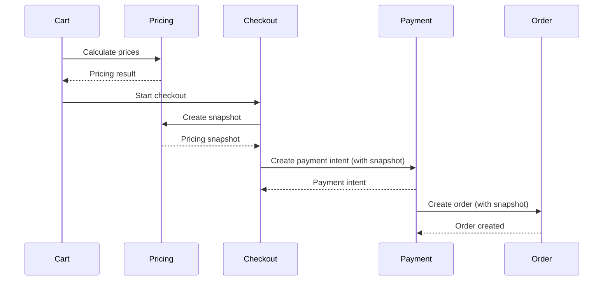

# Pricing Snapshots

## Overview

Pricing snapshots are immutable records of pricing calculations created at payment intent creation. They ensure that prices remain consistent throughout the checkout process, even if price lists change.

## Why Snapshots?

- **Price Consistency**: Prevents price changes during checkout
- **Order History**: Accurate record of prices at time of purchase
- **Audit Trail**: Track pricing changes over time
- **Reconciliation**: Verify pricing accuracy

## Snapshot Structure

```typescript
interface PricingSnapshot extends PricingEngineResult {
  engineVersion: string; // e.g., "pricing-engine-v1"
  rulesetVersion: number; // Increments on price list changes
  computedAt: string; // ISO timestamp
  ruleHash: string; // SHA-256 hash of price lists
  bundleBreakdowns?: BundlePricingBreakdown[]; // Bundle pricing details
}
```

## Snapshot Creation

Snapshots are created when payment intent is created:

```typescript
// During order creation
const pricingResult = await pricingEngine.run({
  variants: cartItems,
  customer: customer,
  priceLists: activePriceLists,
  now: new Date()
});

const snapshot = createPricingSnapshot(
  pricingResult,
  activePriceLists,
  rulesetVersion,
  bundleBreakdowns
);
```

## Snapshot Fields

### engineVersion

Version of the pricing engine used:

```typescript
engineVersion: "pricing-engine-v1"
```

Used to detect engine changes that might affect pricing.

### rulesetVersion

Increments when price lists change:

```typescript
rulesetVersion: 42
```

Locks snapshot to specific price list version.

### computedAt

ISO timestamp when snapshot was created:

```typescript
computedAt: "2025-12-18T10:30:00.000Z"
```

### ruleHash

SHA-256 hash of price lists used:

```typescript
ruleHash: "a1b2c3d4e5f6..."
```

Detects if price lists changed between snapshot creation and order creation.

### bundleBreakdowns

Detailed pricing breakdown for bundles:

```typescript
bundleBreakdowns: [
  {
    bundleId: "bundle-123",
    bundleLineId: "line-456",
    unitBundlePrice: 999.99,
    variantBreakdown: [
      { variantId: "variant-1", unitPrice: 499.99, quantity: 1 },
      { variantId: "variant-2", unitPrice: 499.99, quantity: 1 }
    ]
  }
]
```

## Snapshot Storage

Snapshots are stored in:

1. **Checkout Session** (Redis): Temporary storage during checkout
2. **Payment Intent** (Database): Stored with payment intent
3. **Order** (Database): Final storage with order record

## Snapshot Validation

Snapshots are validated at multiple points:

### 1. Payment Intent Creation

```typescript
// Validate snapshot matches current pricing
const currentPricing = await pricingEngine.run(...);
if (snapshot.totalEffectivePrice !== currentPricing.totalEffectivePrice) {
  throw new Error("Pricing drift detected");
}
```

### 2. Order Creation

```typescript
// Validate rule hash matches
const currentHash = computePriceListHash(currentPriceLists);
if (snapshot.ruleHash !== currentHash) {
  // Log drift but allow order (price lists may have changed)
  await auditService.logDrift(...);
}
```

### 3. Webhook Processing

```typescript
// Validate snapshot matches webhook payment amount
if (snapshot.totalEffectivePrice !== webhookAmount) {
  throw new Error("Payment amount mismatch");
}
```

## Snapshot Lifecycle



## Snapshot Usage

### Order History

```typescript
// Retrieve order with snapshot
const order = await ordersService.findOne(orderId);
const snapshot = order.pricingSnapshot;

// Display original prices
console.log(`Original price: ₹${snapshot.totalEffectivePrice}`);
```

### Reconciliation

```typescript
// Compare snapshot to current pricing
const currentPricing = await pricingEngine.run(...);
const drift = currentPricing.totalEffectivePrice - snapshot.totalEffectivePrice;

if (Math.abs(drift) > 0.01) {
  await auditService.logDrift({
    orderId: order.id,
    snapshotPrice: snapshot.totalEffectivePrice,
    currentPrice: currentPricing.totalEffectivePrice,
    drift
  });
}
```

## Best Practices

1. **Always Create Snapshots**: Create snapshots at payment intent creation
2. **Validate Early**: Validate snapshots before order creation
3. **Store Immutably**: Never modify snapshots after creation
4. **Monitor Drift**: Track pricing drift over time
5. **Version Control**: Use engine version to detect engine changes

## Edge Cases

- **Price List Changed**: Snapshot rule hash won't match, log drift
- **Engine Updated**: Engine version won't match, may affect pricing
- **Bundle Changed**: Bundle breakdown may not match current bundle
- **Missing Snapshot**: Should not happen, but handle gracefully

