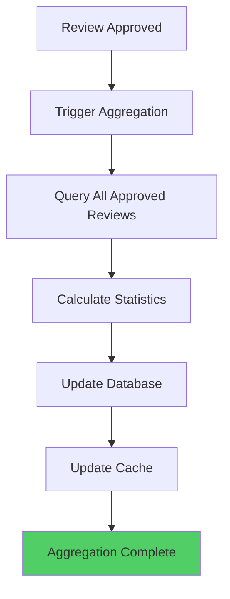

# Review Aggregation

Review aggregation calculates and maintains product review statistics, including average ratings, rating distributions, and review counts. These aggregates are used for product display and search ranking.

## Aggregation Overview

### What is Aggregation?

Aggregation computes summary statistics from individual reviews:
- **Average Rating**: Mean rating across all approved reviews
- **Rating Distribution**: Count of reviews per rating (1-5 stars)
- **Review Count**: Total number of approved reviews
- **Last Review Date**: Most recent review timestamp

### Aggregation Flow



## Aggregate Data Structure

### Aggregate Entity

```typescript
interface VariantReviewAggregate {
  variantId: string;
  averageRating: number;      // 0.0 - 5.0
  reviewCount: number;         // Total approved reviews
  rating1Count: number;        // 1-star reviews
  rating2Count: number;        // 2-star reviews
  rating3Count: number;        // 3-star reviews
  rating4Count: number;        // 4-star reviews
  rating5Count: number;        // 5-star reviews
  updatedAt: Date;
}
```

## Aggregation Process

### Recompute Aggregate

```typescript
async recomputeAggregate(variantId: string): Promise<void> {
  // Get all approved reviews for this variant
  const approvedReviews = await db
    .select({
      rating: reviews.rating,
    })
    .from(reviews)
    .where(
      and(
        eq(reviews.variantId, variantId),
        eq(reviews.status, "approved"),
      ),
    );

  const reviewCount = approvedReviews.length;

  if (reviewCount === 0) {
    // No reviews - set to zero/default
    await this.setEmptyAggregate(variantId);
    return;
  }

  // Calculate aggregates
  const ratingCounts = {
    1: 0,
    2: 0,
    3: 0,
    4: 0,
    5: 0,
  };

  let totalRating = 0;
  for (const review of approvedReviews) {
    ratingCounts[review.rating as keyof typeof ratingCounts]++;
    totalRating += review.rating;
  }

  const averageRating = totalRating / reviewCount;

  // Update database
  await db
    .insert(variantReviewAggregate)
    .values({
      variantId,
      averageRating,
      reviewCount,
      rating1Count: ratingCounts[1],
      rating2Count: ratingCounts[2],
      rating3Count: ratingCounts[3],
      rating4Count: ratingCounts[4],
      rating5Count: ratingCounts[5],
      updatedAt: new Date(),
    })
    .onConflictDoUpdate({
      target: variantReviewAggregate.variantId,
      set: {
        averageRating,
        reviewCount,
        rating1Count: ratingCounts[1],
        rating2Count: ratingCounts[2],
        rating3Count: ratingCounts[3],
        rating4Count: ratingCounts[4],
        rating5Count: ratingCounts[5],
        updatedAt: new Date(),
      },
    });

  // Update cache
  await this.cacheService.setAggregate(variantId, {
    variantId,
    averageRating,
    reviewCount,
    rating1Count: ratingCounts[1],
    rating2Count: ratingCounts[2],
    rating3Count: ratingCounts[3],
    rating4Count: ratingCounts[4],
    rating5Count: ratingCounts[5],
    updatedAt: new Date(),
  });
}
```

### Empty Aggregate

```typescript
async setEmptyAggregate(variantId: string): Promise<void> {
  await db
    .insert(variantReviewAggregate)
    .values({
      variantId,
      averageRating: 0,
      reviewCount: 0,
      rating1Count: 0,
      rating2Count: 0,
      rating3Count: 0,
      rating4Count: 0,
      rating5Count: 0,
    })
    .onConflictDoUpdate({
      target: variantReviewAggregate.variantId,
      set: {
        averageRating: 0,
        reviewCount: 0,
        rating1Count: 0,
        rating2Count: 0,
        rating3Count: 0,
        rating4Count: 0,
        rating5Count: 0,
        updatedAt: new Date(),
      },
    });

  // Update cache
  await this.cacheService.setAggregate(variantId, {
    variantId,
    averageRating: 0,
    reviewCount: 0,
    rating1Count: 0,
    rating2Count: 0,
    rating3Count: 0,
    rating4Count: 0,
    rating5Count: 0,
    updatedAt: new Date(),
  });
}
```

## Triggering Aggregation

### When Aggregation Happens

Aggregation is triggered when:
1. **Review Approved**: Review status changes to `approved`
2. **Review Rejected**: Review status changes to `rejected` (recalculate)
3. **Review Updated**: Review rating or content updated
4. **Review Deleted**: Review removed from system

### Aggregation Triggers

```typescript
// On review approval
async approveReview(reviewId: string): Promise<void> {
  // ... approval logic ...
  
  // Trigger aggregation
  await this.aggregationService.recomputeAggregate(review.variantId);
}

// On review rejection
async rejectReview(reviewId: string): Promise<void> {
  // ... rejection logic ...
  
  // Recalculate aggregate (exclude rejected review)
  await this.aggregationService.recomputeAggregate(review.variantId);
}

// On review update
async updateReview(reviewId: string, updates: ReviewUpdate): Promise<void> {
  // ... update logic ...
  
  // Recalculate if rating changed
  if (updates.rating) {
    await this.aggregationService.recomputeAggregate(review.variantId);
  }
}
```

## Retrieving Aggregates

### Get Aggregate

```typescript
async getAggregate(
  variantId: string,
): Promise<ReviewAggregateDto | null> {
  // Try cache first
  const cached = await this.cacheService.getAggregate(variantId);
  if (cached) {
    return cached;
  }

  // Get from database
  const [aggregate] = await db
    .select()
    .from(variantReviewAggregate)
    .where(eq(variantReviewAggregate.variantId, variantId))
    .limit(1);

  if (!aggregate) {
    return null;
  }

  const result: ReviewAggregateDto = {
    variantId: aggregate.variantId,
    averageRating: Number(aggregate.averageRating),
    reviewCount: aggregate.reviewCount,
    rating1Count: aggregate.rating1Count,
    rating2Count: aggregate.rating2Count,
    rating3Count: aggregate.rating3Count,
    rating4Count: aggregate.rating4Count,
    rating5Count: aggregate.rating5Count,
    updatedAt: aggregate.updatedAt,
  };

  // Cache it
  await this.cacheService.setAggregate(variantId, result);

  return result;
}
```

## Average Rating Calculation

### Rating Formula

```typescript
averageRating = sum(allRatings) / reviewCount
```

### Example Calculation

For reviews with ratings: [5, 4, 5, 3, 4]

```
totalRating = 5 + 4 + 5 + 3 + 4 = 21
reviewCount = 5
averageRating = 21 / 5 = 4.2
```

### Rating Distribution

```typescript
// Rating distribution example
{
  rating1Count: 0,  // 0 reviews
  rating2Count: 0,  // 0 reviews
  rating3Count: 1,  // 1 review
  rating4Count: 2,  // 2 reviews
  rating5Count: 2,  // 2 reviews
}
```

## Real-time Updates

### Incremental Updates

Aggregates update immediately when reviews change:

```typescript
// Review approved → aggregate updated
await this.approveReview(reviewId);
// Aggregate automatically recalculated

// Review rejected → aggregate updated
await this.rejectReview(reviewId);
// Aggregate automatically recalculated
```

### Batch Processing

For bulk operations, aggregates can be batch updated:

```typescript
async batchRecomputeAggregates(variantIds: string[]): Promise<void> {
  for (const variantId of variantIds) {
    await this.recomputeAggregate(variantId);
  }
}
```

## Cache Integration

### Cache Strategy

```typescript
// Cache aggregate with no expiration (persistent)
await this.cacheService.setAggregate(variantId, aggregate);

// Cache key: product_review_agg:{variantId}
// TTL: 0 (no expiration, invalidated on updates)
```

### Cache Invalidation

```typescript
// Invalidate cache when aggregate changes
async recomputeAggregate(variantId: string): Promise<void> {
  // ... calculate aggregate ...
  
  // Update cache
  await this.cacheService.setAggregate(variantId, aggregate);
  
  // Cache is automatically updated, no need to invalidate
}
```

## API Endpoints

### Get Review Aggregate

```http
GET /storefront/products/{productId}/variants/{variantId}/reviews/aggregate
```

**Response**:
```json
{
  "variantId": "variant-123",
  "averageRating": 4.5,
  "reviewCount": 42,
  "rating1Count": 2,
  "rating2Count": 3,
  "rating3Count": 5,
  "rating4Count": 15,
  "rating5Count": 17,
  "updatedAt": "2024-12-18T10:00:00Z"
}
```

## Performance Considerations

### Database Indexes

```sql
-- Optimized index for aggregate lookups
CREATE INDEX CONCURRENTLY variant_review_aggregate_variant_id_idx
ON variant_review_aggregate(variant_id);
```

### Query Optimization

- Aggregates stored in separate table (denormalized)
- Fast lookups via variant ID
- Cached for instant access

## Use Cases

### Product Display

```typescript
// Display average rating and review count
const aggregate = await this.getAggregate(variantId);
displayRating(aggregate.averageRating, aggregate.reviewCount);
```

### Search Ranking

```typescript
// Use aggregate for search ranking
const aggregate = await this.getAggregate(variantId);
const score = calculateSearchScore({
  averageRating: aggregate.averageRating,
  reviewCount: aggregate.reviewCount,
});
```

### Filtering

```typescript
// Filter products by rating
const products = await db
  .select()
  .from(products)
  .innerJoin(
    variantReviewAggregate,
    eq(products.variantId, variantReviewAggregate.variantId),
  )
  .where(gte(variantReviewAggregate.averageRating, 4.0));
```

## Best Practices

1. **Real-time Updates**: Update aggregates immediately on review changes
2. **Cache First**: Check cache before database lookup
3. **Batch Operations**: Batch aggregate updates for bulk operations
4. **Error Handling**: Handle aggregation failures gracefully
5. **Monitoring**: Track aggregation performance

## Edge Cases

### No Reviews

- Aggregate set to zero/default values
- Average rating is 0
- Review count is 0

### Single Review

- Average rating equals review rating
- Distribution shows one rating count

### Rating Changes

- Aggregate recalculated when rating updated
- Old rating removed, new rating added
- Average and distribution updated

