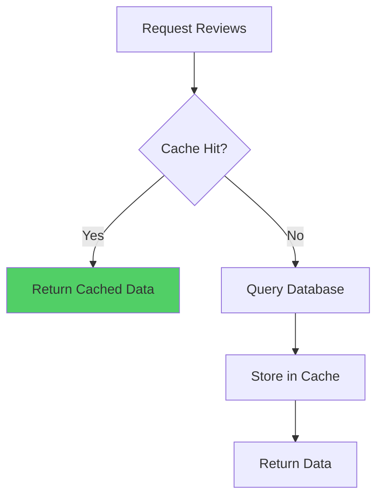

# Review Caching

Review caching optimizes performance by storing frequently accessed review data in Redis. This reduces database load and improves response times for product pages and review listings.

## Caching Overview

### Cache Strategy

Reviews use a persistent caching strategy:
- **No Expiration**: Cache entries don't expire automatically
- **Invalidation-Based**: Cache cleared when reviews change
- **Query-Based Keys**: Cache keys include query parameters

### Cache Flow



## Cache Key Patterns

### Key Structure

```typescript
const KEY_PATTERNS = {
  // Reviews list with query hash
  REVIEWS: (variantId: string, queryHash: string) =>
    `product_reviews:${variantId}:${queryHash}`,
  
  // Review aggregate
  AGGREGATE: (variantId: string) => `product_review_agg:${variantId}`,
} as const;
```

### Query Hashing

```typescript
private hashQuery(query: ReviewQueryDto): string {
  const parts = [
    query.page?.toString() || "1",
    query.limit?.toString() || "20",
    query.sort || "newest",
    query.minRating?.toString(),
    query.imagesOnly ? "images" : null,
  ].filter(Boolean);
  
  return parts.join(":");
}
```

## Caching Reviews

### Get Reviews from Cache

```typescript
async getReviews(
  variantId: string,
  query: ReviewQueryDto,
): Promise<PaginatedReviews | null> {
  try {
    const queryHash = this.hashQuery(query);
    const key = KEY_PATTERNS.REVIEWS(variantId, queryHash);
    const cached = await this.client.get(key);

    if (!cached) {
      return null;
    }

    return JSON.parse(cached);
  } catch (error) {
    this.logger.warn(
      createErrorContext(this.contextService, "getReviews", error, {
        variantId,
      }),
      "Failed to get reviews from cache",
    );
    return null;
  }
}
```

### Set Reviews in Cache

```typescript
async setReviews(
  variantId: string,
  query: ReviewQueryDto,
  data: PaginatedReviews,
): Promise<void> {
  try {
    const queryHash = this.hashQuery(query);
    const key = KEY_PATTERNS.REVIEWS(variantId, queryHash);
    
    // Cache with no expiration (persistent cache)
    await this.client.set(key, JSON.stringify(data));
  } catch (error) {
    this.logger.warn(
      createErrorContext(this.contextService, "setReviews", error, {
        variantId,
      }),
      "Failed to set reviews in cache",
    );
  }
}
```

## Caching Aggregates

### Get Aggregate from Cache

```typescript
async getAggregate(
  variantId: string,
): Promise<ReviewAggregateDto | null> {
  try {
    const key = KEY_PATTERNS.AGGREGATE(variantId);
    const cached = await this.client.get(key);

    if (!cached) {
      return null;
    }

    return JSON.parse(cached);
  } catch (error) {
    this.logger.warn(
      createErrorContext(this.contextService, "getAggregate", error, {
        variantId,
      }),
      "Failed to get aggregate from cache",
    );
    return null;
  }
}
```

### Set Aggregate in Cache

```typescript
async setAggregate(
  variantId: string,
  aggregate: ReviewAggregateDto,
): Promise<void> {
  try {
    const key = KEY_PATTERNS.AGGREGATE(variantId);
    
    // Cache with no expiration (persistent cache)
    await this.client.set(key, JSON.stringify(aggregate));
  } catch (error) {
    this.logger.warn(
      createErrorContext(this.contextService, "setAggregate", error, {
        variantId,
      }),
      "Failed to set aggregate in cache",
    );
  }
}
```

## Cache Invalidation

### Invalidate Variant Cache

```typescript
async invalidateVariant(variantId: string): Promise<void> {
  try {
    // Find all review keys for this variant
    const pattern = `product_reviews:${variantId}:*`;
    const keys = await this.client.keys(pattern);
    
    // Delete all review list caches
    if (keys.length > 0) {
      await this.client.del(...keys);
    }
    
    // Aggregate is updated, not invalidated
    // (it's set directly with new values)
  } catch (error) {
    this.logger.warn(
      createErrorContext(this.contextService, "invalidateVariant", error, {
        variantId,
      }),
      "Failed to invalidate variant cache",
    );
  }
}
```

### Invalidation Triggers

Cache is invalidated when:
1. **Review Approved**: Review becomes visible
2. **Review Rejected**: Review removed from visible set
3. **Review Updated**: Review content or rating changed
4. **Review Deleted**: Review removed from system

### Invalidation Flow

```typescript
// On review approval
async approveReview(reviewId: string): Promise<void> {
  // ... approval logic ...
  
  // Invalidate cache
  await this.cacheService.invalidateVariant(review.variantId);
  
  // Update aggregate (which updates aggregate cache)
  await this.aggregationService.recomputeAggregate(review.variantId);
}
```

## Cache TTL Strategy

### No Expiration

```typescript
const CACHE_TTL = 0; // No expiration

// Cache entries persist until invalidated
// This ensures consistency and performance
```

### Why No Expiration?

- **Consistency**: Cache always matches database after invalidation
- **Performance**: No cache misses due to expiration
- **Control**: Explicit invalidation ensures accuracy

## Cache Usage in Service Layer

### Reviews Service

```typescript
async findByVariant(
  variantId: string,
  query: ReviewQueryDto,
  customerId?: string,
): Promise<PaginatedReviews> {
  // Try cache first (only if no customerId - cache doesn't have helpful status)
  const cached = await this.cacheService.getReviews(variantId, query);
  if (cached && !customerId) {
    return cached;
  }

  // Query database
  const reviews = await this.queryReviewsFromDatabase(variantId, query);
  
  // Cache result (if no customerId)
  if (!customerId) {
    await this.cacheService.setReviews(variantId, query, reviews);
  }
  
  return reviews;
}
```

### Aggregate Service

```typescript
async getAggregate(variantId: string): Promise<ReviewAggregateDto | null> {
  // Try cache first
  const cached = await this.cacheService.getAggregate(variantId);
  if (cached) {
    return cached;
  }

  // Get from database
  const aggregate = await this.getAggregateFromDatabase(variantId);
  
  if (!aggregate) {
    return null;
  }

  // Cache it
  await this.cacheService.setAggregate(variantId, aggregate);

  return aggregate;
}
```

## Cache Performance

### Cache Hit Rate

```typescript
// Track cache performance
cache_hit_total: counter
cache_miss_total: counter
cache_hit_rate: gauge // hit_total / (hit_total + miss_total)
```

### Cache Benefits

- **Reduced Database Load**: Fewer queries to database
- **Faster Response Times**: Cache lookups are fast (< 1ms)
- **Scalability**: Handles high traffic efficiently

## Cache Warming

### Pre-populate Cache

```typescript
async warmCache(variantIds: string[]): Promise<void> {
  for (const variantId of variantIds) {
    // Pre-fetch aggregates
    await this.aggregationService.getAggregate(variantId);
    
    // Pre-fetch common queries
    await this.reviewsService.findByVariant(variantId, {
      page: 1,
      limit: 20,
      sort: "newest",
    });
  }
}
```

## Error Handling

### Cache Failures

```typescript
// Cache failures don't break the application
try {
  const cached = await this.cacheService.getReviews(variantId, query);
  if (cached) return cached;
} catch (error) {
  // Log but continue to database
  this.logger.warn("Cache lookup failed, falling back to database", error);
}

// Always fall back to database
return await this.queryReviewsFromDatabase(variantId, query);
```

## Best Practices

1. **Cache First**: Always check cache before database
2. **Invalidate Properly**: Invalidate cache on all review changes
3. **Error Handling**: Handle cache failures gracefully
4. **Monitor Performance**: Track cache hit rates
5. **Query Hashing**: Use consistent query hashing for cache keys

## Edge Cases

### Cache Miss

- Fall back to database query
- Store result in cache for next request
- No performance impact for occasional misses

### Cache Invalidation Race

- Multiple updates may cause race conditions
- Last update wins (eventual consistency)
- Aggregate updates are idempotent

### Cache Size

- Monitor Redis memory usage
- Implement cache eviction if needed
- Consider cache partitioning for large catalogs

