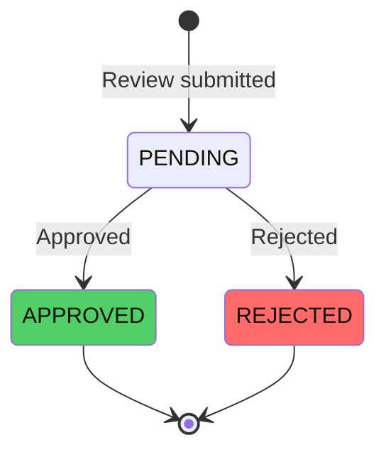

# Review Moderation

Review moderation ensures that only appropriate, authentic reviews are published. The system supports both automated and manual moderation workflows to maintain review quality and prevent spam.

## Moderation Overview

### Moderation States



### Review Status

```typescript
enum ReviewStatus {
  PENDING = "pending",    // Awaiting moderation
  APPROVED = "approved",  // Published and visible
  REJECTED = "rejected",  // Rejected during moderation
}
```

## Automated Moderation

### Auto-Approval Threshold

Reviews with high confidence scores are auto-approved:

```typescript
const AUTO_APPROVE_THRESHOLD = 0.8; // 80% confidence

if (moderationScore >= AUTO_APPROVE_THRESHOLD) {
  await this.approveReview(reviewId);
} else {
  // Send to manual review queue
  await this.queueForManualReview(reviewId);
}
```

### Moderation Scoring

```typescript
interface ModerationResult {
  status: ReviewStatus;
  flags: ModerationFlag[];
  score: number;        // 0-100 confidence score
  reasons: string[];    // Rejection reasons
}

enum ModerationFlag {
  SPAM = "spam",
  OFFENSIVE = "offensive",
  INAPPROPRIATE = "inappropriate",
  FAKE = "fake",
  IRRELEVANT = "irrelevant",
}
```

## Moderation Rules

### Spam Detection

```typescript
// Pattern matching for spam
const spamPatterns = [
  /\b(?:viagra|casino|lottery|click here)\b/i,
  /https?:\/\/[^\s]+/g, // URLs in reviews
  /[A-Z]{20,}/, // Excessive caps
];

function detectSpam(review: Review): boolean {
  const text = `${review.title} ${review.body}`.toLowerCase();
  
  for (const pattern of spamPatterns) {
    if (pattern.test(text)) {
      return true;
    }
  }
  
  return false;
}
```

### Content Filtering

```typescript
// Profanity filter
const profanityList = ["bad", "word", "list"]; // Configurable

function containsProfanity(text: string): boolean {
  const lowerText = text.toLowerCase();
  return profanityList.some(word => lowerText.includes(word));
}

// Inappropriate content detection
function isInappropriate(review: Review): boolean {
  // Check title and body
  if (containsProfanity(review.title || "")) return true;
  if (containsProfanity(review.body)) return true;
  
  // Check for excessive caps
  if (/^[A-Z\s]{50,}$/.test(review.body)) return true;
  
  return false;
}
```

### Relevance Check

```typescript
// Ensure review relates to purchased product
function isRelevant(review: Review, order: Order): boolean {
  // Check if variant is in order
  const orderVariants = order.items.map(item => item.productVariantId);
  return orderVariants.includes(review.variantId);
}
```

### Authenticity Verification

```typescript
// Cross-reference with purchase history
async function verifyAuthenticity(
  review: Review,
  customerId: string,
): Promise<boolean> {
  // Verify order belongs to customer
  const order = await this.getOrder(review.orderId);
  if (order.customerId !== customerId) {
    return false;
  }
  
  // Verify order is delivered
  if (order.status !== "delivered") {
    return false;
  }
  
  // Verify variant is in order
  const hasVariant = order.items.some(
    item => item.productVariantId === review.variantId,
  );
  
  return hasVariant;
}
```

## Manual Moderation

### Manual Review Queue

```typescript
interface ManualReviewQueue {
  reviewId: string;
  priority: "high" | "medium" | "low";
  flags: ModerationFlag[];
  assignedTo?: string;  // Admin user ID
  reviewedAt?: Date;
}
```

### Queue Management

```typescript
async queueForManualReview(reviewId: string): Promise<void> {
  const review = await this.getReview(reviewId);
  
  // Determine priority
  const priority = this.calculatePriority(review);
  
  // Add to queue
  await db.insert(manualReviewQueue).values({
    reviewId,
    priority,
    flags: review.moderationFlags || [],
  });
  
  // Notify moderators
  await this.notifyModerators({
    type: "NEW_REVIEW_QUEUED",
    reviewId,
    priority,
  });
}
```

### Priority Calculation

```typescript
function calculatePriority(review: Review): "high" | "medium" | "low" {
  // High priority: Multiple flags, high-value product
  if (review.moderationFlags.length > 2) return "high";
  if (review.productPrice > 10000) return "high";
  
  // Medium priority: Single flag, moderate value
  if (review.moderationFlags.length === 1) return "medium";
  
  // Low priority: Borderline cases
  return "low";
}
```

## Approving Reviews

### Approval Process

```typescript
async approveReview(reviewId: string): Promise<ReviewResponseDto> {
  const [review] = await db
    .select()
    .from(reviews)
    .where(eq(reviews.id, reviewId))
    .limit(1);

  if (!review) {
    throw new BadRequestException(`Review with ID ${reviewId} not found`);
  }

  if (review.status === "approved") {
    throw new BadRequestException("Review is already approved");
  }

  // Update status
  const [updatedReview] = await db
    .update(reviews)
    .set({
      status: "approved",
      updatedAt: new Date(),
    })
    .where(eq(reviews.id, reviewId))
    .returning();

  // Recompute aggregate statistics
  await this.aggregationService.recomputeAggregate(updatedReview.variantId);

  // Invalidate cache
  await this.cacheService.invalidateVariant(updatedReview.variantId);

  // Emit event
  await this.eventsService.emitApproved({
    reviewId: updatedReview.id,
    variantId: updatedReview.variantId,
    customerId: updatedReview.customerId,
    rating: updatedReview.rating,
    timestamp: updatedReview.updatedAt.toISOString(),
  });

  return this.enrichReview(updatedReview);
}
```

### Approval Effects

When a review is approved:
1. **Status Updated**: Review status set to `approved`
2. **Statistics Updated**: Product review aggregates recalculated
3. **Cache Invalidated**: Review cache cleared for variant
4. **Event Emitted**: Approval event logged
5. **Visibility**: Review becomes visible to customers

## Rejecting Reviews

### Rejection Process

```typescript
async rejectReview(
  reviewId: string,
  reason?: string,
): Promise<ReviewResponseDto> {
  const [review] = await db
    .select()
    .from(reviews)
    .where(eq(reviews.id, reviewId))
    .limit(1);

  if (!review) {
    throw new BadRequestException(`Review with ID ${reviewId} not found`);
  }

  if (review.status === "rejected") {
    throw new BadRequestException("Review is already rejected");
  }

  // Update status
  const [updatedReview] = await db
    .update(reviews)
    .set({
      status: "rejected",
      updatedAt: new Date(),
    })
    .where(eq(reviews.id, reviewId))
    .returning();

  // Emit event
  await this.eventsService.emitRejected({
    reviewId: updatedReview.id,
    variantId: updatedReview.variantId,
    customerId: updatedReview.customerId,
    reason: reason || "Rejected during moderation",
    timestamp: updatedReview.updatedAt.toISOString(),
  });

  return this.enrichReview(updatedReview);
}
```

### Rejection Reasons

```typescript
enum RejectionReason {
  SPAM = "Spam detected",
  OFFENSIVE = "Offensive content",
  INAPPROPRIATE = "Inappropriate language",
  FAKE = "Fake review",
  IRRELEVANT = "Not relevant to product",
  DUPLICATE = "Duplicate review",
  POLICY_VIOLATION = "Policy violation",
}
```

## Bulk Moderation

### Bulk Approve

```typescript
async bulkApprove(reviewIds: string[]): Promise<void> {
  for (const reviewId of reviewIds) {
    try {
      await this.approveReview(reviewId);
    } catch (error) {
      this.logger.error(`Failed to approve review ${reviewId}`, error);
    }
  }
}
```

### Bulk Reject

```typescript
async bulkReject(
  reviewIds: string[],
  reason: string,
): Promise<void> {
  for (const reviewId of reviewIds) {
    try {
      await this.rejectReview(reviewId, reason);
    } catch (error) {
      this.logger.error(`Failed to reject review ${reviewId}`, error);
    }
  }
}
```

## Moderation Queue

### Get Pending Reviews

```typescript
async getPendingReviews(
  page = 1,
  limit = 20,
): Promise<PaginatedReviews> {
  const offset = (page - 1) * limit;
  
  const [reviews, total] = await Promise.all([
    db
      .select()
      .from(reviews)
      .where(eq(reviews.status, "pending"))
      .orderBy(desc(reviews.createdAt))
      .limit(limit)
      .offset(offset),
    db
      .select({ count: sql<number>`count(*)` })
      .from(reviews)
      .where(eq(reviews.status, "pending")),
  ]);

  return {
    data: reviews.map(this.enrichReview),
    total: Number(total[0]?.count || 0),
    page,
    limit,
    totalPages: Math.ceil(Number(total[0]?.count || 0) / limit),
  };
}
```

## API Endpoints

### Moderate Review

```http
PATCH /admin/reviews/{reviewId}/moderate
Content-Type: application/json

{
  "status": "approved",
  "moderationNote": "Approved after manual review"
}
```

### Bulk Moderate

```http
POST /admin/reviews/bulk-moderate
Content-Type: application/json

{
  "reviewIds": ["review-1", "review-2"],
  "status": "approved"
}
```

### Get Pending Reviews

```http
GET /admin/reviews?status=pending&page=1&limit=50
```

## Moderation Metrics

### Tracking Metrics

```typescript
// Moderation metrics
review_moderation_total: counter
review_approval_rate: gauge
review_rejection_rate: gauge
moderation_queue_length: gauge
moderation_processing_time: histogram
```

## Best Practices

1. **Automated First**: Use automated moderation for clear cases
2. **Manual Review**: Queue borderline cases for human review
3. **Consistent Rules**: Apply moderation rules consistently
4. **Transparency**: Provide clear rejection reasons
5. **Appeals Process**: Allow review authors to appeal rejections

## Edge Cases

### Borderline Content

- Content that's not clearly spam or appropriate
- Queue for manual review
- Multiple moderators can review

### False Positives

- Legitimate reviews flagged as spam
- Manual review corrects mistakes
- Learn from corrections to improve automation

### High-Volume Periods

- Handle moderation queue during sales
- Scale moderation capacity
- Prioritize high-value products

